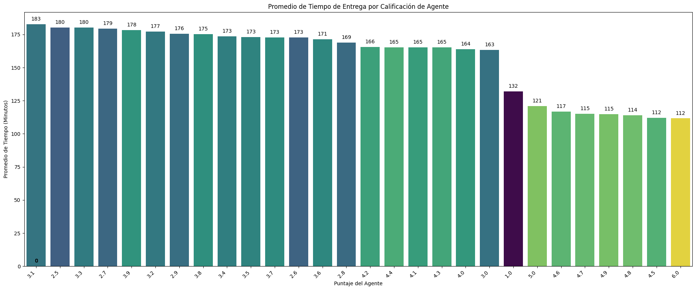
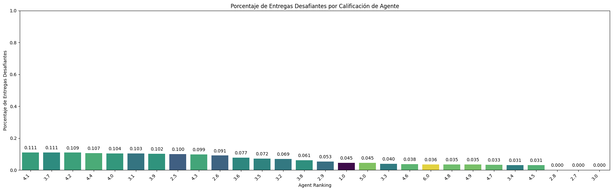
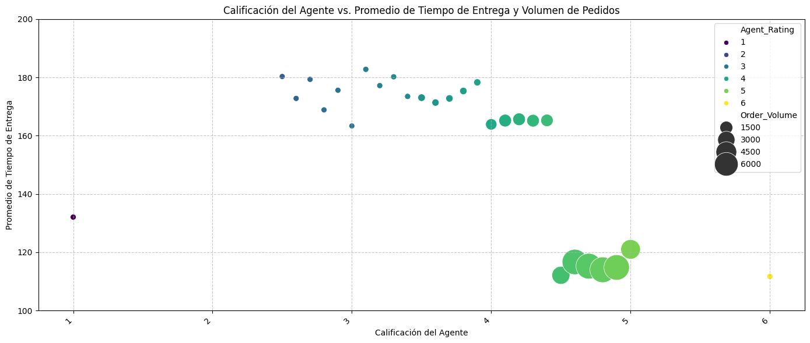

# 📊 Amazon Delivery 
# Análisis de eficiencia en entregas de última milla

Este proyecto consiste en un dashboard interactivo y la generación de reportes ejecutivos. Ambas herramientas están diseñadas para analizar el rendimiento de la entrega de pedidos. Los datos utilizados provienen de un conjunto de datos real de entregas recopilado por [Sujal Suthar](https://www.kaggle.com/datasets/sujalsuthar/amazon-delivery-dataset/data), con información valiosa para entender y mejorar la eficiencia operativa.

---

## 📚 Tabla de Contenidos

- [🎯 Propósito](#-propósito)
- [📦 Conjunto de Datos](#-conjunto-de-datos)
- [🧪 Desarrollo del Proyecto](#-desarrollo-del-proyecto)
- [📌 Vista previa del Dashboard](#-vista-previa-del-dashboard)
- [💡 Insight clave](#-insight-clave)
- [🛠️ Tecnologías](#️-tecnologías)
- [📂 Archivos](#️-instalación)
- [👤 Autor](#-autor)
- [📝 Licencia](#-licencia)

---

## 🎯 Propósito

El propósito principal de este proyecto es optimizar la eficiencia en la entrega de pedidos. Para lograrlo, analizaremos datos en tiempo real con el fin de:

- Evaluar la eficiencia general de nuestras entregas.
- Identificar zonas geográficas y franjas horarias con mayores desafíos operativos.
- Reconocer el desempeño individual de los repartidores, destacando a los más eficientes y detectando áreas de mejora.
---

## 📦 Conjunto de Datos

El conjunto de datos utilizado contiene las siguientes columnas:

- `Order_ID`: Identificador único para cada pedido
- `Agent_age`: Edad del agente de entrega
- `Agent_Rating`: Calificación o puntuación de desempeño del agente de entrega
- `Store_Latitude`: Coordenadas geográficas (latitud) de la tienda donde se realizó el pedido
- `Store_Longitude`: Coordenadas geográficas (longitud) de la tienda donde se realizó el pedido
- `Drop_Latitude`: Coordenadas geográficas (latitud) del lugar de entrega
- `Drop_Longitude`: Coordenadas geográficas (longitud) del lugar de entrega
- `Order_Date`: Fecha en que se realizó el pedido
- `Order_Time`: Hora del pedido
- `Pickup_Time`: Hora en que se recogió el pedido para su entrega
- `Weather`: Condiciones climáticas durante la entrega (por ejemplo: sunny, rainy, snowy)
- `Traffic`: Condiciones del tráfico durante la entrega (por ejemplo: low, medium, jam)
- `Vehicle`: Tipo de vehiculo utilizado para la entrega (por ejemplo: van, motorcycle, bicycle, scooter)
- `Area`: Zona donde se realizó la entrega (Urban, Metropolitan)
- `Delivery_Time`: Tiempo que llevo completar la entrega
- `Category`: Categoría de producto del articulo pedido (por ejemplo: electronics, apparel, groceries)

Fuente: [Amazon Delivery Dataset](https://www.kaggle.com/datasets/sujalsuthar/amazon-delivery-dataset).

---

## 🧪 Desarrollo del Proyecto

### 1. **Creación y carga de la base de datos**

Este apartado describe los pasos para cargar, explorar y preparar inicialmente el conjunto de datos amazon_delivery.csv en una base de datos MySQL.

1. Origen de los Datos
El conjunto de datos utilizado para este análisis es amazon_delivery.csv, obtenido de Kaggle. Contiene información relacionada con entregas de Amazon.

2. Configuración de la Base de Datos
Para comenzar, necesitamos crear y seleccionar la base de datos donde se almacenarán nuestros datos.

```SQL
CREATE DATABASE amazon_delivery;
USE amazon_delivery; -- Asegúrate de seleccionar la base de datos correcta
```

3. Carga de Datos
Los datos se cargaron en la base de datos MySQL utilizando la interfaz gráfica de MySQL Workbench, específicamente el "Table Data Import Wizard".

Pasos para cargar los datos usando MySQL Workbench:
1. Crear la base de datos: Ejecuta la sentencia CREATE DATABASE amazon_delivery; o créala manualmente.
2. Seleccionar la base de datos: Haz doble clic en la base de datos amazon_delivery en el panel "Schemas" para seleccionarla, o usa la sentencia USE amazon_delivery;.
3. Iniciar el asistente de importación: Haz clic derecho en el apartado de "Tables" dentro de tu base de datos amazon_delivery.
4. Seleccionar "Table Data Import Wizard": Elige esta opción del menú contextual.
5. Seleccionar la ruta del archivo CSV: Navega y selecciona el archivo amazon_delivery.csv desde tu sistema de archivos.
6. Seleccionar "Create new table": Elige esta opción para crear una nueva tabla donde se importarán los datos.
7. Configurar los tipos de datos: Revisa y ajusta los tipos de datos sugeridos por el asistente para cada columna, asegurándote de que coincidan con el formato de tus datos (por ejemplo, VARCHAR para texto, INT o DECIMAL para números, DATE para fechas, etc.).

Finalizar la importación: Haz clic en "Next" y sigue las instrucciones finales para que el asistente comience a crear la tabla y cargar los datos.

4. Verificación y Exploración Inicial
Una vez que los datos se han cargado, puedes verificar que la tabla se haya creado correctamente y realizar una exploración inicial seleccionando todas las filas de la tabla:
```SQL
SELECT * FROM amazon_delivery;
```
Este comando te permitirá ver las primeras filas de los datos importados y confirmar que la carga fue exitosa.

***Archivo: [create_db.sql](sql/create_db.sql)***

### 2. **Exploración inicial de los datos**

Una vez que los datos han sido cargados en la base de datos amazon_delivery, se realiza una serie de consultas SQL para obtener una comprensión inicial de la estructura, el volumen y la calidad de los datos.

1. Verificación de los Datos Iniciales
Esta consulta permite visualizar las primeras 10 filas de la tabla amazon para tener una idea rápida de su contenido y formato.
```SQL
SELECT
    *
FROM
    amazon
LIMIT 10;
```

Esta consulta confirmar que los datos se han cargado correctamente y observar un extracto representativo de las filas.

2. Descripción de los Tipos de Datos
La sentencia DESCRIBE proporciona información sobre la estructura de la tabla, incluyendo los nombres de las columnas, sus tipos de datos, si aceptan valores nulos y si tienen claves.

```SQL
DESCRIBE amazon;
```

`DESCRIBRE` nos ayudo a entender los tipos de datos asignados a cada columna durante la importación, lo cual es crucial para planificar futuras transformaciones y limpieza.

3. Conteo de Registros
Esta consulta cuenta el número total de filas en la tabla, utilizando Order_ID como una columna no nula para el conteo.

```SQL
SELECT
    COUNT(Order_ID) AS cantidad_registros
FROM
    amazon;
```

El determinar el volumen total del conjunto de datos, nos ayuda a evaluar la escala del análisis.

4. Identificación de Valores Problemáticos (Cadenas Vacías, 'NaN', Espacios en Blanco)
Esta serie de consultas UNION ALL está diseñada para identificar registros que contienen valores "problemáticos" en columnas de texto o en columnas que, aunque deberían ser numéricas o de fecha, podrían haber sido importadas como texto y contener indicadores de valores faltantes o inválidos como cadenas vacías (''), la cadena 'NaN', o cadenas con solo espacios en blanco.

```SQL
SELECT
    'Order_ID' AS column_name, Order_ID AS problematic_value FROM amazon WHERE TRIM(Order_ID) = '' OR TRIM(Order_ID) = 'NaN' OR TRIM(Order_ID) LIKE '%NaN%'
UNION ALL
SELECT
    'Weather' AS column_name, Weather FROM amazon WHERE TRIM(Weather) = '' OR TRIM(Weather) = 'NaN' OR TRIM(Weather) LIKE '%NaN%'
UNION ALL
SELECT
    'Traffic' AS column_name, Traffic FROM amazon WHERE TRIM(Traffic) = '' OR TRIM(Traffic) = 'NaN' OR TRIM(Traffic) LIKE '%NaN%'
UNION ALL
SELECT
    'Vehicle' AS column_name, Vehicle FROM amazon WHERE TRIM(Vehicle) = '' OR TRIM(Vehicle) = 'NaN' OR TRIM(Vehicle) LIKE '%NaN%'
UNION ALL
SELECT
    'Area' AS column_name, Area FROM amazon WHERE TRIM(Area) = '' OR TRIM(Area) = 'NaN' OR TRIM(Area) LIKE '%NaN%'
UNION ALL
SELECT
    'Category' AS column_name, Category FROM amazon WHERE TRIM(Category) = '' OR TRIM(Category) = 'NaN' OR TRIM(Category) LIKE '%NaN%'
UNION ALL
SELECT
    'Order_Time' AS column_name, Order_Time FROM amazon WHERE TRIM(Order_Time) = '' OR TRIM(Order_Time) = 'NaN' OR TRIM(Order_Time) LIKE '%NaN%'
UNION ALL
SELECT
    'Pickup_Time' AS column_name, Pickup_Time FROM amazon WHERE TRIM(Pickup_Time) = '' OR TRIM(Pickup_Time) = 'NaN' OR TRIM(Pickup_Time) LIKE '%NaN%'
UNION ALL
SELECT
    'Order_Date' AS column_name, Order_Date FROM amazon WHERE TRIM(Order_Date) = '' OR TRIM(Order_Date) = 'NaN' OR TRIM(Order_Date) LIKE '%NaN%'
UNION ALL
SELECT
    'Agent_Age' AS column_name, Agent_Age FROM amazon WHERE Agent_Age IS NOT NULL AND (TRIM(Agent_Age) = '' OR TRIM(Agent_Age) = 'NaN' OR TRIM(Agent_Age) LIKE '%NaN%')
UNION ALL
SELECT
    'Agent_Rating' AS column_name, Agent_Rating FROM amazon WHERE Agent_Rating IS NOT NULL AND (TRIM(Agent_Rating) = '' OR TRIM(Agent_Rating) = 'NaN' OR TRIM(Agent_Rating) LIKE '%NaN%')
UNION ALL
SELECT
    'Store_Latitude' AS column_name, Store_Latitude FROM amazon WHERE Store_Latitude IS NOT NULL AND (TRIM(Store_Latitude) = '' OR TRIM(Store_Latitude) = 'NaN' OR TRIM(Store_Latitude) LIKE '%NaN%')
UNION ALL
SELECT
    'Store_Longitude' AS column_name, Store_Longitude FROM amazon WHERE Store_Longitude IS NOT NULL AND (TRIM(Store_Longitude) = '' OR TRIM(Store_Longitude) = 'NaN' OR TRIM(Store_Longitude) LIKE '%NaN%')
UNION ALL
SELECT
    'Drop_Latitude' AS column_name, Drop_Latitude FROM amazon WHERE Drop_Latitude IS NOT NULL AND (TRIM(Drop_Latitude) = '' OR TRIM(Drop_Latitude) = 'NaN' OR TRIM(Drop_Latitude) LIKE '%NaN%')
UNION ALL
SELECT
    'Drop_Longitude' AS column_name, Drop_Longitude FROM amazon WHERE Drop_Longitude IS NOT NULL AND (TRIM(Drop_Longitude) = '' OR TRIM(Drop_Longitude) = 'NaN' OR TRIM(Drop_Longitude) LIKE '%NaN%')
UNION ALL
SELECT
    'Delivery_Time' AS column_name, Delivery_Time FROM amazon WHERE Delivery_Time IS NOT NULL AND (TRIM(Delivery_Time) = '' OR TRIM(Delivery_Time) = 'NaN' OR TRIM(Delivery_Time) LIKE '%NaN%');
```

Lograr detectar valores inconsistentes o faltantes que no son NULL, pero que representan datos inválidos (como cadenas vacías o textos como "NaN"), es un paso clave durante la fase de limpieza de datos.

### 3. **Limpieza y preprocesamiento**
Las primeras etapas del proceso de limpieza y transformación de los datos en la tabla amazon, enfocándose en la estandarización de valores, la corrección de tipos de datos y la identificación de inconsistencias.

1. Reemplazo de Valores Problemáticos por NULL
Antes de realizar cualquier conversión de tipo de dato, es crucial estandarizar los valores que representan datos faltantes o inválidos. Esta consulta UPDATE reemplaza cadenas vacías (''), la cadena 'NaN' o subcadenas que contengan 'NaN' por NULL en las columnas Order_Time, Weather y Traffic.

```SQL
UPDATE amazon
SET
    -- Para columnas de tiempo/fecha:
    Order_Time = CASE WHEN TRIM(Order_Time) = '' OR TRIM(Order_Time) LIKE '%NaN%' THEN NULL ELSE Order_Time END,
    -- Para otras columnas TEXT:
    Weather = CASE WHEN TRIM(Weather) = '' OR TRIM(Weather) LIKE '%NaN%' THEN NULL ELSE Weather END,
    Traffic = CASE WHEN TRIM(Traffic) = '' OR TRIM(Traffic) LIKE '%NaN%' THEN NULL ELSE Traffic END;
```
Realizar este paso nos ayuda a preparar los datos para conversiones de tipo más precisas, asegurando que los valores ausentes sean representados uniformemente como NULL.

2. Identificación de Valores Nulos
Después de la primera fase de reemplazo, se realiza una verificación exhaustiva para contar la cantidad de valores NULL en cada columna. Esto proporciona una visión clara de la completitud de los datos, lo cual es fundamental para decidir las estrategias de imputación o eliminación.

```SQL
SELECT
    SUM(CASE WHEN Order_ID IS NULL THEN 1 ELSE 0 END) AS nulos_Order_ID,
    SUM(CASE WHEN Agent_age IS NULL THEN 1 ELSE 0 END) AS nulos_Agent_age,
    SUM(CASE WHEN Agent_Rating IS NULL THEN 1 ELSE 0 END) AS nulos_Agent_Rating,
    SUM(CASE WHEN Store_Latitude IS NULL THEN 1 ELSE 0 END) AS nulos_Store_Latitude,
    SUM(CASE WHEN Store_Longitude IS NULL THEN 1 ELSE 0 END) AS nulos_Store_Longitude,
    SUM(CASE WHEN Drop_Latitude IS NULL THEN 1 ELSE 0 END) AS nulos_Drop_Latitude,
    SUM(CASE WHEN Drop_Longitude IS NULL THEN 1 ELSE 0 END) AS nulos_Drop_Longitude,
    SUM(CASE WHEN Order_Date IS NULL THEN 1 ELSE 0 END) AS nulos_Order_Date,
    SUM(CASE WHEN Order_Time IS NULL THEN 1 ELSE 0 END) AS nulos_Order_Time,
    SUM(CASE WHEN Pickup_Time IS NULL THEN 1 ELSE 0 END) AS nulos_Pickup_Time,
    SUM(CASE WHEN Weather IS NULL THEN 1 ELSE 0 END) AS nulos_Weather,
    SUM(CASE WHEN Traffic IS NULL THEN 1 ELSE 0 END) AS nulos_Traffic,
    SUM(CASE WHEN Vehicle IS NULL THEN 1 ELSE 0 END) AS nulos_Vehicle,
    SUM(CASE WHEN Area IS NULL THEN 1 ELSE 0 END) AS nulos_Area,
    SUM(CASE WHEN Delivery_Time IS NULL THEN 1 ELSE 0 END) AS nulos_Delivery_Time,
    SUM(CASE WHEN Category IS NULL THEN 1 ELSE 0 END) AS nulos_Category
FROM
    amazon;
```

3. Transformación de Columnas de Tiempo (Order_Time, Pickup_Time)
Este paso se encarga de convertir las columnas de tiempo, que originalmente podrían haber sido importadas como TEXT, a un tipo de dato TIME adecuado para análisis de tiempo. Se utilizan columnas temporales para asegurar la integridad de los datos durante la transformación.

    1. Añadir columnas temporales:

    ```SQL
    ALTER TABLE amazon
    ADD COLUMN temp_order_time TIME,
    ADD COLUMN temp_pickup_time TIME;
    ```

    2. Convertir y poblar:

    ```SQL
    UPDATE amazon
    SET
        temp_order_time = STR_TO_DATE(Order_Time, '%H:%i:%s'),
        temp_pickup_time = STR_TO_DATE(Pickup_Time, '%H:%i:%s');
    ```

    3. Verificar la conversión:

    ```SQL
    SELECT
        Order_Time,
        temp_order_time,
        Pickup_Time,
        temp_pickup_time
    FROM
        amazon
    LIMIT 10;
    ```

    4. Eliminar columnas originales:

    ```SQL
    ALTER TABLE amazon
    DROP COLUMN Order_Time,
    DROP COLUMN Pickup_Time;
    ```

    5. Renombrar columnas temporales:

    ```SQL
    ALTER TABLE amazon
    CHANGE COLUMN temp_order_time Order_Time TIME,
    CHANGE COLUMN temp_pickup_time Pickup_Time TIME;
    ```

4. Transformación de la Columna de Fecha (Order_Date)
Similar al proceso de las columnas de tiempo, esta sección se dedica a convertir Order_Date a un tipo de dato DATE.

    1. Añadir columna temporal:

    ```SQL
    ALTER TABLE amazon
    ADD COLUMN temp_order_date DATE;
    ```

    2. Convertir y poblar:

    ```SQL
    UPDATE amazon
    SET temp_order_date = DATE(Order_Date);
    ```

    3. Verificar la conversión (opcional):

    ```SQL
    SELECT
        Order_Date, temp_order_date
    FROM
        amazon
    LIMIT
        10;
    ```

    4. Eliminar columna original:

    ```SQL
    ALTER TABLE amazon
    DROP COLUMN Order_Date;
    ```

    5. Renombrar columna temporal:

    ```SQL
    ALTER TABLE amazon
    CHANGE COLUMN temp_order_date Order_Date DATE;
    ```

5. Limpieza de Cadenas de Texto (Eliminar Espacios Extra)
Esta operación UPDATE utiliza la función TRIM() para eliminar espacios en blanco al inicio y al final de las cadenas en varias columnas de texto.

```SQL
UPDATE amazon
SET
    Weather = TRIM(Weather),
    Traffic = TRIM(Traffic),
    Vehicle = TRIM(Vehicle),
    Area = TRIM(Area),
    Category = TRIM(Category);
```

6. Re-evaluación de Valores Nulos
Se realiza una segunda verificación de valores nulos después de las transformaciones de tipo y la limpieza de cadenas.

```SQL
SELECT
    SUM(CASE WHEN Order_ID IS NULL THEN 1 ELSE 0 END) AS nulos_Order_ID,
    SUM(CASE WHEN Agent_age IS NULL THEN 1 ELSE 0 END) AS nulos_Agent_age,
    SUM(CASE WHEN Agent_Rating IS NULL THEN 1 ELSE 0 END) AS nulos_Agent_Rating,
    SUM(CASE WHEN Store_Latitude IS NULL THEN 1 ELSE 0 END) AS nulos_Store_Latitude,
    SUM(CASE WHEN Store_Longitude IS NULL THEN 1 ELSE 0 END) AS nulos_Store_Longitude,
    SUM(CASE WHEN Drop_Latitude IS NULL THEN 1 ELSE 0 END) AS nulos_Drop_Latitude,
    SUM(CASE WHEN Drop_Longitude IS NULL THEN 1 ELSE 0 END) AS nulos_Drop_Longitude,
    SUM(CASE WHEN Order_Date IS NULL THEN 1 ELSE 0 END) AS nulos_Order_Date,
    SUM(CASE WHEN Order_Time IS NULL THEN 1 ELSE 0 END) AS nulos_Order_Time,
    SUM(CASE WHEN Pickup_Time IS NULL THEN 1 ELSE 0 END) AS nulos_Pickup_Time,
    SUM(CASE WHEN Weather IS NULL THEN 1 ELSE 0 END) AS nulos_Weather,
    SUM(CASE WHEN Traffic IS NULL THEN 1 ELSE 0 END) AS nulos_Traffic,
    SUM(CASE WHEN Vehicle IS NULL THEN 1 ELSE 0 END) AS nulos_Vehicle,
    SUM(CASE WHEN Area IS NULL THEN 1 ELSE 0 END) AS nulos_Area,
    SUM(CASE WHEN Delivery_Time IS NULL THEN 1 ELSE 0 END) AS nulos_Delivery_Time,
    SUM(CASE WHEN Category IS NULL THEN 1 ELSE 0 END) AS nulos_Category
FROM
    amazon;
```

7. Búsqueda de Valores Negativos o Fuera de Rango
Esta consulta identifica registros donde las columnas numéricas (Agent_Age, Agent_Rating, coordenadas de latitud/longitud, Delivery_Time) contienen valores negativos o valores de latitud/longitud que están fuera de los rangos geográficos válidos.

```SQL
SELECT
    Agent_Age,
    Agent_Rating,
    Store_Latitude,
    Store_Longitude,
    Drop_Latitude,
    Drop_Longitude,
    Delivery_Time
FROM
    amazon
WHERE
    Agent_Age < 0 OR
    Agent_Rating < 0 OR
    Store_Latitude < -90 OR Store_Latitude > 90 OR -- Latitud fuera de rango
    Store_Longitude < -180 OR Store_Longitude > 180 OR -- Longitud fuera de rango
    Drop_Latitude < -90 OR Drop_Latitude > 90 OR
    Drop_Longitude < -180 OR Drop_Longitude > 180 OR
    Delivery_Time < 0;
```

8. Identificación de Registros Completamente Duplicados
Se verifica la existencia de filas que son idénticas en todas sus columnas.

```SQL
SELECT
    Order_ID,
    Agent_age,
    Agent_Rating,
    Store_Latitude,
    Store_Longitude,
    Drop_Latitude,
    Drop_Longitude,
    Order_Date,
    Order_Time,
    Pickup_Time,
    Weather,
    Traffic,
    Vehicle,
    Area,
    Delivery_Time,
    Category,
    COUNT(*) AS cant_duplicados
FROM
    amazon
GROUP BY
    Order_ID,
    Agent_age,
    Agent_Rating,
    Store_Latitude,
    Store_Longitude,
    Drop_Latitude,
    Drop_Longitude,
    Order_Date,
    Order_Time,
    Pickup_Time,
    Weather,
    Traffic,
    Vehicle,
    Area,
    Delivery_Time,
    Category
HAVING
    COUNT(*) > 1;
```

9. Verificación de la Estructura y Datos Finales
Finalmente, se revisa la estructura de la tabla y se visualizan las primeras filas para confirmar que todas las transformaciones de esta primera parte se hayan aplicado correctamente.

```SQL
DESCRIBE amazon;
```

```SQL
SELECT
    *
FROM
    amazon
LIMIT
    10;
```

***Archivo: [limpieza_transformacion.sql](sql/limpieza_transformacion.sql)***

10. Verificación Inicial de Registros y Nulos
Antes de proceder con la imputación, se realiza una verificación para conocer el volumen total de registros y la cantidad de nulos presentes en las columnas objetivo.

* Conteo total de registros:
```SQL
SELECT
    COUNT(*) AS cant_registro
FROM
    amazon;
```
> Resultado: 43685 registros.

* Identificación de registros con nulos en columnas clave:
```SQL
SELECT
    *
FROM
    amazon
WHERE
    Order_Time IS NULL
OR
    Weather IS NULL
OR
    Traffic IS NULL;
```

* Conteo específico de nulos por columna:
```SQL
SELECT
    SUM(CASE WHEN Order_Time IS NULL THEN 1 ELSE 0 END) AS nulos_Order_Time,
    SUM(CASE WHEN Weather IS NULL THEN 1 ELSE 0 END) AS nulos_Weather,
    SUM(CASE WHEN Traffic IS NULL THEN 1 ELSE 0 END) AS nulos_Traffic
FROM
    amazon;
```

11. Imputación de Datos en Order_Time
La imputación de Order_Time se realiza estimando el tiempo de pedido basándose en la diferencia promedio entre Pickup_Time y Order_Time para los registros completos.

* Paso 1: Calcular el promedio de la diferencia de tiempo
Se calcula la diferencia promedio en segundos entre Pickup_Time y Order_Time para todos los registros donde ambos valores son válidos y Order_Time es anterior o igual a Pickup_Time.

```SQL
SET @promedio_delta_segundos = (
    SELECT AVG(TIME_TO_SEC(TIMEDIFF(Pickup_Time, Order_Time)))
    FROM amazon
    WHERE Order_Time IS NOT NULL
      AND Order_Time <= Pickup_Time
);
```

* Paso 2: Actualizar registros con Order_Time nulo
Se actualiza Order_Time restando el promedio_delta_segundos al Pickup_Time de los registros donde Order_Time es NULL.

```SQL
UPDATE amazon
SET Order_Time = DATE_SUB(Pickup_Time, INTERVAL @promedio_delta_segundos SECOND)
WHERE Order_Time IS NULL;
````
Verificar la cantidad de nulos en Order_Time después de la imputación:
```SQL
SELECT
    SUM(CASE WHEN Order_Time IS NULL THEN 1 ELSE 0 END) AS nulos_Order_Time
FROM
    amazon;
```

* Paso 3: Revisar y corregir valores negativos en Order_Time
Se identifican y corrigen los casos donde Order_Time pudo haber resultado en un valor negativo (antes de medianoche) debido a la imputación, especialmente si Pickup_Time era 00:00:00.

```SQL
-- Conteo de valores negativos
SELECT
    COUNT(*)
FROM
    amazon
WHERE
    Order_Time < '00:00:00';
```

```SQL
-- Identificación de registros con valores negativos
SELECT
    *
FROM
    amazon
WHERE
    Order_Time < '00:00:00';
```

```SQL
-- Corrección de valores negativos
UPDATE amazon
SET Order_Time = '00:00:00'
WHERE Order_Time < '00:00:00'
  AND Pickup_Time = '00:00:00';
```

12. Imputación para Weather y Traffic
Para imputar Weather y Traffic, se utiliza una estrategia basada en la moda (el valor más frecuente) de estas columnas dentro de "vecindarios" definidos por la latitud y longitud redondeadas, y la fecha del pedido. Esto asume que el clima y el tráfico son similares en ubicaciones y fechas cercanas.

Se definen variables para la precisión del redondeo de las coordenadas:

```SQL
SET @lat_precision = 2; -- Ej: Redondear a 2 decimales (aprox. 1.1 km de 'vecindario')
SET @lon_precision = 2; -- Ej: Redondear a 2 decimales
```

Imputación para Weather
* Paso 1: Crear tabla temporal con conteos de Weather por zona y fecha

 ```SQL
    CREATE TEMPORARY TABLE IF NOT EXISTS temp_weather_counts AS
    SELECT
        ROUND(Drop_Latitude, @lat_precision) AS rounded_lat,
        ROUND(Drop_Longitude, @lon_precision) AS rounded_lon,
        Order_Date,
        Weather,
        COUNT(*) AS cnt
    FROM
        amazon
    WHERE
        Weather IS NOT NULL
    GROUP BY
        rounded_lat,
        rounded_lon,
        Order_Date,
        Weather;
```

* Paso 2: Encontrar el conteo máximo para cada grupo (moda)

```SQL    
    CREATE TEMPORARY TABLE IF NOT EXISTS temp_max_counts AS
    SELECT
        rounded_lat,
        rounded_lon,
        Order_Date,
        MAX(cnt) AS max_cnt
    FROM
        temp_weather_counts
    GROUP BY
        rounded_lat,
        rounded_lon,
        Order_Date;
```

* Paso 3: Obtener la moda de Weather por grupo

```SQL  
    CREATE TEMPORARY TABLE IF NOT EXISTS final_weather_modes AS
    SELECT
        twc.rounded_lat,
        twc.rounded_lon,
        twc.Order_Date,
        twc.Weather
    FROM
        temp_weather_counts twc
    JOIN
        temp_max_counts tmc ON
        twc.rounded_lat = tmc.rounded_lat AND
        twc.rounded_lon = tmc.rounded_lon AND
        twc.Order_Date = tmc.Order_Date AND
        twc.cnt = tmc.max_cnt;
```

* Paso 4: Actualizar la tabla original amazon con los valores imputados

```SQL  
    UPDATE amazon a
    JOIN final_weather_modes fwm ON
        ROUND(a.Drop_Latitude, @lat_precision) = fwm.rounded_lat AND
        ROUND(a.Drop_Longitude, @lon_precision) = fwm.rounded_lon AND
        a.Order_Date = fwm.Order_Date
    SET
        a.Weather = fwm.Weather
    WHERE
        a.Weather IS NULL;
```

* Limpiar tablas temporales:

```SQL  
    DROP TEMPORARY TABLE IF EXISTS temp_weather_counts;
    DROP TEMPORARY TABLE IF EXISTS temp_max_counts;
    DROP TEMPORARY TABLE IF EXISTS final_weather_modes;
```

* Verificar la cantidad de nulos en Weather después de la imputación:

```SQL 
    SELECT
        SUM(CASE WHEN Weather IS NULL THEN 1 ELSE 0 END) AS nulos_Weather
    FROM
        amazon;
```

Imputación para Traffic

El proceso para imputar Traffic es idéntico al de Weather, utilizando la moda del tráfico en zonas y fechas similares.

* Paso 1: Crear tabla temporal con conteos de Traffic por zona y fecha

```SQL
    CREATE TEMPORARY TABLE IF NOT EXISTS temp_traffic_counts AS
    SELECT
        ROUND(Drop_Latitude, @lat_precision) AS rounded_lat,
        ROUND(Drop_Longitude, @lon_precision) AS rounded_lon,
        Order_Date,
        Traffic,
        COUNT(*) AS cnt
    FROM
        amazon
    WHERE
        Traffic IS NOT NULL
    GROUP BY
        rounded_lat,
        rounded_lon,
        Order_Date,
        Traffic;
```

* Paso 2: Encontrar el conteo máximo para cada grupo (moda)

```SQL
    CREATE TEMPORARY TABLE IF NOT EXISTS temp_max_counts AS
    SELECT
        rounded_lat,
        rounded_lon,
        Order_Date,
        MAX(cnt) AS max_cnt
    FROM
        temp_traffic_counts
    GROUP BY
        rounded_lat,
        rounded_lon,
        Order_Date;
```

* Paso 3: Obtener la moda de Traffic por grupo

```SQL
    CREATE TEMPORARY TABLE IF NOT EXISTS final_traffic_modes AS
    SELECT
        twc.rounded_lat,
        twc.rounded_lon,
        twc.Order_Date,
        twc.Traffic
    FROM
        temp_traffic_counts twc
    JOIN
        temp_max_counts tmc ON
        twc.rounded_lat = tmc.rounded_lat AND
        twc.rounded_lon = tmc.rounded_lon AND
        twc.Order_Date = tmc.Order_Date AND
        twc.cnt = tmc.max_cnt;
```

* Paso 4: Actualizar la tabla original amazon con los valores imputados

```SQL
    UPDATE amazon a
    JOIN final_traffic_modes fwm ON
        ROUND(a.Drop_Latitude, @lat_precision) = fwm.rounded_lat AND
        ROUND(a.Drop_Longitude, @lon_precision) = fwm.rounded_lon AND
        a.Order_Date = fwm.Order_Date
    SET
        a.Traffic = fwm.Traffic
    WHERE
        a.Traffic IS NULL;
```

* Limpiar tablas temporales:

```SQL
    DROP TEMPORARY TABLE IF EXISTS temp_traffic_counts;
    DROP TEMPORARY TABLE IF EXISTS temp_max_counts;
    DROP TEMPORARY TABLE IF EXISTS final_traffic_modes;
```

* Verificar la cantidad de nulos en Traffic después de la imputación:

```SQL
    SELECT
        COUNT(*) AS nulos_Traffic
    FROM
        amazon
    WHERE
        Traffic IS NULL;
```

13. Eliminación de Valores Nulos Restantes
Después de los intentos de imputación, se eliminan los registros que aún contienen valores NULL en las columnas Weather y Traffic, ya que no pudieron ser imputados con la estrategia definida.

* Revisar los registros con nulos restantes:
```SQL
SELECT * FROM amazon WHERE Weather IS NULL;
SELECT * FROM amazon WHERE Traffic IS NULL;
```

* Eliminar registros con nulos en Weather:
```SQL
DELETE FROM amazon
WHERE Weather IS NULL;
```

* Eliminar registros con nulos en Traffic:
```SQL
DELETE FROM amazon
WHERE Traffic IS NULL;
```

* Revisar la cantidad de registros después de la eliminación:
```SQL
SELECT
    COUNT(*) AS cant_registro
FROM
    amazon;
```
Resultado: La cantidad de registros pasó de 43685 a 43644.

***Archivo: [Imputación_eliminación _order_time_weather_traffic.sql](sql/inputacion_eliminacion_order_time_weather_traffic.sql)***

### 4. **Exportación de datos limpios**

Una vez que los datos han sido limpiados y preprocesados, se preparan para la exportación. Esto implica verificar la cantidad final de registros y seleccionar todos los datos de la tabla amazon para su posterior uso.

Conteo final de registros: Esta consulta confirma el número total de registros en la tabla después de todas las operaciones de limpieza, imputación y eliminación.
```SQL
SELECT
    COUNT(*) AS cantidad_registros
FROM
    amazon;
```

Resultado: 43644 registros.

Selección de datos para exportar: Esta consulta selecciona todas las columnas y filas de la tabla amazon, que ahora contiene los datos limpios y transformados.
```SQL
SELECT
    *
FROM
    amazon;
```

Pasos para exportar los datos desde MySQL Workbench: Después de ejecutar la consulta SELECT * FROM amazon;, puedes exportar los resultados haciendo clic en la opción "Export" (o un icono similar a un disquete/flecha hacia abajo) que suele aparecer en la barra de herramientas de resultados de la consulta en MySQL Workbench. Esto te permitirá guardar los datos en un formato de archivo como CSV, JSON, etc.

***Archivo: [exportacion_datos.sql](sql/exportacion_datos.sql)***

### 4. **Análisis exploratorio de datos (EDA)**

La fase inicial del Análisis Exploratorio de Datos (EDA) se utilizo Python y las librerías ``pandas, numpy, seaborn, matplotlib``. El objetivo es cargar el conjunto de datos limpio, comprender su estructura, tipos de datos y realizar las transformaciones necesarias para un análisis posterior.

1. Carga de Librerías Necesarias
Se importan las librerías pandas para la manipulación de datos, numpy para operaciones numéricas, y seaborn junto con matplotlib.pyplot para la visualización de datos.

```Python
import pandas as pd
import numpy as np
import seaborn as sns
import matplotlib.pyplot as plt
```

2. Carga del Conjunto de Datos
El conjunto de datos amazon_delivery_limpios.csv, resultado de la fase de limpieza y preprocesamiento en MySQL, se carga en un DataFrame de pandas. Se muestra las primeras filas para una inspección rápida.

```Python
df_amazon_delivery = pd.read_csv('../data/processed/amazon_delivery_limpios.csv')
df_amazon_delivery.head()
```

Salida:

<table border="1" class="dataframe">
  <thead>
    <tr style="text-align: right;">
      <th></th>
      <th>Order_ID</th>
      <th>Agent_Age</th>
      <th>Agent_Rating</th>
      <th>Store_Latitude</th>
      <th>Store_Longitude</th>
      <th>Drop_Latitude</th>
      <th>Drop_Longitude</th>
      <th>Weather</th>
      <th>Traffic</th>
      <th>Vehicle</th>
      <th>Area</th>
      <th>Delivery_Time</th>
      <th>Category</th>
      <th>Order_Time</th>
      <th>Pickup_Time</th>
      <th>Order_Date</th>
    </tr>
  </thead>
  <tbody>
    <tr>
      <th>0</th>
      <td>ialx566343618</td>
      <td>37</td>
      <td>4.9</td>
      <td>22.745049</td>
      <td>75.892471</td>
      <td>22.765049</td>
      <td>75.912471</td>
      <td>Sunny</td>
      <td>High</td>
      <td>motorcycle</td>
      <td>Urban</td>
      <td>120</td>
      <td>Clothing</td>
      <td>11:30:00</td>
      <td>11:45:00</td>
      <td>2022-03-19</td>
    </tr>
    <tr>
      <th>1</th>
      <td>akqg208421122</td>
      <td>34</td>
      <td>4.5</td>
      <td>12.913041</td>
      <td>77.683237</td>
      <td>13.043041</td>
      <td>77.813237</td>
      <td>Stormy</td>
      <td>Jam</td>
      <td>scooter</td>
      <td>Metropolitian</td>
      <td>165</td>
      <td>Electronics</td>
      <td>19:45:00</td>
      <td>19:50:00</td>
      <td>2022-03-25</td>
    </tr>
    <tr>
      <th>2</th>
      <td>njpu434582536</td>
      <td>23</td>
      <td>4.4</td>
      <td>12.914264</td>
      <td>77.678400</td>
      <td>12.924264</td>
      <td>77.688400</td>
      <td>Sandstorms</td>
      <td>Low</td>
      <td>motorcycle</td>
      <td>Urban</td>
      <td>130</td>
      <td>Sports</td>
      <td>08:30:00</td>
      <td>08:45:00</td>
      <td>2022-03-19</td>
    </tr>
    <tr>
      <th>3</th>
      <td>rjto796129700</td>
      <td>38</td>
      <td>4.7</td>
      <td>11.003669</td>
      <td>76.976494</td>
      <td>11.053669</td>
      <td>77.026494</td>
      <td>Sunny</td>
      <td>Medium</td>
      <td>motorcycle</td>
      <td>Metropolitian</td>
      <td>105</td>
      <td>Cosmetics</td>
      <td>18:00:00</td>
      <td>18:10:00</td>
      <td>2022-04-05</td>
    </tr>
    <tr>
      <th>4</th>
      <td>zguw716275638</td>
      <td>32</td>
      <td>4.6</td>
      <td>12.972793</td>
      <td>80.249982</td>
      <td>13.012793</td>
      <td>80.289982</td>
      <td>Cloudy</td>
      <td>High</td>
      <td>scooter</td>
      <td>Metropolitian</td>
      <td>150</td>
      <td>Toys</td>
      <td>13:30:00</td>
      <td>13:45:00</td>
      <td>2022-03-26</td>
    </tr>
  </tbody>
</table>
</div>

3. Exploración del Conjunto de Datos
Se obtiene la cantidad de filas y columnas del DataFrame para entender su dimensionalidad.

```Python
filas, columnas = df_amazon_delivery.shape
print(f'El conjunto de datos amazon_delivery_limpio.csv contiene:\nfilas:{filas:>10}\ncolumnas:{columnas:>7}')
```

Salida:
```bash
El conjunto de datos amazon_delivery_limpio.csv contiene:
filas:     43644
columnas:     16
```

4. Tipos de Datos de Cada Columna
Se utiliza el método info() para obtener un resumen conciso del DataFrame, incluyendo el número de entradas no nulas y el tipo de dato de cada columna.

```Python
df_amazon_delivery.info()
```

Salida:
```bash
<class 'pandas.core.frame.DataFrame'>
RangeIndex: 43644 entries, 0 to 43643
Data columns (total 16 columns):
 #   Column           Non-Null Count  Dtype  
---  ------           --------------  -----  
 0   Order_ID         43644 non-null  object 
 1   Agent_Age        43644 non-null  int64  
 2   Agent_Rating     43644 non-null  float64
 3   Store_Latitude   43644 non-null  float64
 4   Store_Longitude  43644 non-null  float64
 5   Drop_Latitude    43644 non-null  float64
 6   Drop_Longitude   43644 non-null  float64
 7   Weather          43644 non-null  object 
 8   Traffic          43644 non-null  object 
 9   Vehicle          43644 non-null  object 
 10  Area             43644 non-null  object 
 11  Delivery_Time    43644 non-null  int64  
 12  Category         43644 non-null  object 
 13  Order_Time       43644 non-null  object 
 14  Pickup_Time      43644 non-null  object 
 15  Order_Date       43644 non-null  object 
dtypes: float64(5), int64(2), object(9)
memory usage: 5.3+ MB
```
Observaciones:
Las columnas ``Order_Time``, ``Pickup_Time`` y ``Order_Date`` fueron importadas como tipo object (cadena de texto) y necesitan ser convertidas a tipos de datos de tiempo y fecha (timedelta y datetime respectivamente) para permitir operaciones temporales. Los tipos de datos de las demás columnas son correctos.

5. Transformación de Tipos de Datos
Se realizan las conversiones de tipo de dato necesarias para las columnas de tiempo y fecha.

Transformación de Order_Time y Pickup_Time a timedelta:`

Se utiliza ``pd.to_timedelta()`` para convertir las cadenas de tiempo en objetos Timedelta, que representan duraciones de tiempo. Se crean nuevas columnas ``Order_Time_TD`` y ``Pickup_Time_TD`` para almacenar estos valores.

```Python
df_amazon_delivery['Order_Time_TD'] = pd.to_timedelta(df_amazon_delivery['Order_Time'])
df_amazon_delivery['Pickup_Time_TD'] = pd.to_timedelta(df_amazon_delivery['Pickup_Time'])
```

Transformación de Order_Date a datetime:

Se convierte la columna ``Order_Date`` a tipo datetime64[ns] utilizando ``pd.to_datetime()``, especificando el formato para una conversión correcta.

```Python
df_amazon_delivery['Order_Date'] = pd.to_datetime(df_amazon_delivery['Order_Date'], format='%Y-%m-%d', errors='coerce')
print('Tipo de Order_Date después de la primera conversion:', df_amazon_delivery['Order_Date'].dtype)
print('\nColumna con solo la fehca')
print(df_amazon_delivery['Order_Date'].head(3))
```

Salida:
```bash
Tipo de Order_Date después de la primera conversion: datetime64[ns]

Columna con solo la fehca
0   2022-03-19
1   2022-03-25
2   2022-03-19
Name: Order_Date, dtype: datetime64[ns]
```

##### **1. Evaluar la Eficiencia General de las Entregas**

* Tiempo Promedio de Entrega

Se calcula el tiempo promedio que tarda una entrega desde que el pedido es realizado hasta que llega al cliente.
```Python
# Calcular el tiempo promedio de entrega (Delivery_Time)
promedio_delivery_time = np.mean(df_amazon_delivery['Delivery_Time'])

# Convertir el total de minutos a horas y minutos
horas = int(promedio_delivery_time // 60) # Obtiene la parte entera de las horas
minutos_restantes = promedio_delivery_time % 60 # Obtiene el resto de minutos

print(f'Promedio del tiempo de entrega (Delivery_Time): {promedio_delivery_time:.2f} minutos')
print(f'Que equivale a: {horas} horas y {minutos_restantes:.0f} minutos') # Redondea los minutos a un entero
```

Salida:
```Bash
Promedio del tiempo de entrega (Delivery_Time): 124.91 minutos
Que equivale a: 2 horas y 5 minutos
```

>Análisis: El tiempo promedio de entrega es de 2 horas y 5 minutos (2:05).

* Tiempo Promedio de Procesamiento del Pedido

Se calcula el tiempo que tarda la tienda o el centro de distribución en preparar el pedido para su recolección por parte del agente de entrega, es decir, la diferencia entre Pickup_Time y Order_Time. Se manejan los casos donde Pickup_Time es anterior a Order_Time (indicando una recogida al día siguiente) sumando un día.
```Python
# Calcular el tiempo promedio de procesamiento del pedido (Pickup_Time - Order_Time)
df_amazon_delivery['Order_Processing_Time'] = df_amazon_delivery['Pickup_Time_TD'] - df_amazon_delivery['Order_Time_TD']

# Si el resultado es negativo, significa que la recogida es "al día siguiente"
# Por lo tanto, le sumamos un día (24 horas)
one_day = pd.Timedelta(days=1)
df_amazon_delivery.loc[df_amazon_delivery['Order_Processing_Time'] < pd.Timedelta(0), 'Order_Processing_Time'] += one_day

promedio_order_processing_time = np.mean(df_amazon_delivery['Order_Processing_Time'])
promedio_en_segundos = promedio_order_processing_time.total_seconds()

# 2. Calcular los minutos enteros
minutos = int(promedio_en_segundos // 60)
# 3. Calcular los segundos restantes y redondearlos al entero más cercano
segundos = round(promedio_en_segundos % 60)

print(f'Promedio de Procesamiento de la orden del pedido (Order_Processing_Time): {promedio_order_processing_time}')
print(f'Promedio de Procesamiento de la orden del pedido: {minutos}:{segundos} minutos')
```
```Bash
Salida:

Promedio de Procesamiento de la orden del pedido (Order_Processing_Time): 0 days 00:09:59.446728072
Promedio de Procesamiento de la orden del pedido: 9:59 minutos
```

>Análisis: El tiempo que tarda la tienda o el centro de distribución en preparar el pedido para su recolección es de aproximadamente 9 minutos y 59 segundos.

* Porcentaje de Entregas a Tiempo

Se calcula el porcentaje de entregas que se consideran "a tiempo" basándose en un umbral determinado por el percentil 95 del tiempo de entrega histórico. Esto permite definir "a tiempo" de una manera que se ajusta al comportamiento real de las entregas.
```Python
# Calcular el porcentaje de entregas a tiempo (Número de entregas a tiempo / Número total de entregas * 100)
# Porcentaje de las entregas que queremos que se consideren "a tiempo"
# Encontrar el tiempo por debajo del cual está el 95% de las entregas
percentil_deseado = 95 # Calcular el Percentil
umbral_calculado = df_amazon_delivery['Delivery_Time'].quantile(percentil_deseado / 100)

print(f'Basado en el {percentil_deseado}% de tus entregas históricas:')
print(f'El {percentil_deseado}º percentil del tiempo de entrega es: {umbral_calculado:.2f} minutos')

numero_entregas_a_tiempo = len(df_amazon_delivery[df_amazon_delivery['Delivery_Time'] <= umbral_calculado])
numero_total_entregas = len(df_amazon_delivery)
porcentaje_entregas_a_tiempo = (numero_entregas_a_tiempo / numero_total_entregas) * 100

print(f'\nUsando {umbral_calculado:.2f} minutos como umbral de "a tiempo":')
print(f'Número de entregas a tiempo: {numero_entregas_a_tiempo}')
print(f'Número total de entregas: {numero_total_entregas}')
print(f'Porcentaje de Entregas a Tiempo (con umbral basado en datos): {porcentaje_entregas_a_tiempo:.2f}%')
```
```Bash
Salida:

Basado en el 95% de tus entregas históricas:
El 95º percentil del tiempo de entrega es: 215.00 minutos

Usando 215.00 minutos como umbral de "a tiempo":
Número de entregas a tiempo: 41559
Número total de entregas: 43644
Porcentaje de Entregas a Tiempo (con umbral basado en datos): 95.22%
```

>Análisis: El 95.22% de los clientes esperan (y reciben) su pedido en 215 minutos (3 horas y 35 minutos). "Se utiliza esta medida ya que no existe una parametros (tiempo estimado de "Entregas a tiempo")

* Distancia Promedio de Entregas

Se calcula la distancia en kilómetros entre la ubicación de la tienda (Store_Latitude, Store_Longitude) y el punto de entrega (Drop_Latitude, Drop_Longitude) utilizando la fórmula de Haversine. Esta distancia es un factor clave que influye en el tiempo de entrega.
```Python
def haversine_vector(lat1, lon1, lat2, lon2):
    R = 6371.0  # Radio de la Tierra en kilómetros
    lat1 = np.radians(lat1)
    lat2 = np.radians(lat2)
    delta_lat = np.radians(lat2 - lat1)
    delta_lon = np.radians(lon2 - lon1)

    a = np.sin(delta_lat / 2)**2 + np.cos(lat1) * np.cos(lat2) * np.sin(delta_lon / 2)**2
    c = 2 * np.arctan2(np.sqrt(a), np.sqrt(1 - a))
    return R * c

# Calcular en lote
df_amazon_delivery["Distance_km"] = haversine_vector(
    df_amazon_delivery["Store_Latitude"],
    df_amazon_delivery["Store_Longitude"],
    df_amazon_delivery["Drop_Latitude"],
    df_amazon_delivery["Drop_Longitude"])

df_amazon_delivery.head(5)
```

Salida (ejemplo de df_amazon_delivery.head(5) con la nueva columna):
<table border="1" class="dataframe">
  <thead>
    <tr style="text-align: right;">
      <th></th>
      <th>Order_ID</th>
      <th>Agent_Age</th>
      <th>Agent_Rating</th>
      <th>Store_Latitude</th>
      <th>Store_Longitude</th>
      <th>Drop_Latitude</th>
      <th>Drop_Longitude</th>
      <th>Weather</th>
      <th>Traffic</th>
      <th>Vehicle</th>
      <th>Area</th>
      <th>Delivery_Time</th>
      <th>Category</th>
      <th>Order_Time</th>
      <th>Pickup_Time</th>
      <th>Order_Date</th>
      <th>Order_Time_TD</th>
      <th>Pickup_Time_TD</th>
      <th>Order_Processing_Time</th>
      <th>Distance_km</th>
    </tr>
  </thead>
  <tbody>
    <tr>
      <th>0</th>
      <td>ialx566343618</td>
      <td>37</td>
      <td>4.9</td>
      <td>22.745049</td>
      <td>75.892471</td>
      <td>22.765049</td>
      <td>75.912471</td>
      <td>Sunny</td>
      <td>High</td>
      <td>motorcycle</td>
      <td>Urban</td>
      <td>120</td>
      <td>Clothing</td>
      <td>11:30:00</td>
      <td>11:45:00</td>
      <td>2022-03-19</td>
      <td>0 days 11:30:00</td>
      <td>0 days 11:45:00</td>
      <td>0 days 00:15:00</td>
      <td>2.051173</td>
    </tr>
    <tr>
      <th>1</th>
      <td>akqg208421122</td>
      <td>34</td>
      <td>4.5</td>
      <td>12.913041</td>
      <td>77.683237</td>
      <td>13.043041</td>
      <td>77.813237</td>
      <td>Stormy</td>
      <td>Jam</td>
      <td>scooter</td>
      <td>Metropolitian</td>
      <td>165</td>
      <td>Electronics</td>
      <td>19:45:00</td>
      <td>19:50:00</td>
      <td>2022-03-25</td>
      <td>0 days 19:45:00</td>
      <td>0 days 19:50:00</td>
      <td>0 days 00:05:00</td>
      <td>14.088346</td>
    </tr>
    <tr>
      <th>2</th>
      <td>njpu434582536</td>
      <td>23</td>
      <td>4.4</td>
      <td>12.914264</td>
      <td>77.678400</td>
      <td>12.924264</td>
      <td>77.688400</td>
      <td>Sandstorms</td>
      <td>Low</td>
      <td>motorcycle</td>
      <td>Urban</td>
      <td>130</td>
      <td>Sports</td>
      <td>08:30:00</td>
      <td>08:45:00</td>
      <td>2022-03-19</td>
      <td>0 days 08:30:00</td>
      <td>0 days 08:45:00</td>
      <td>0 days 00:15:00</td>
      <td>1.083975</td>
    </tr>
    <tr>
      <th>3</th>
      <td>rjto796129700</td>
      <td>38</td>
      <td>4.7</td>
      <td>11.003669</td>
      <td>76.976494</td>
      <td>11.053669</td>
      <td>77.026494</td>
      <td>Sunny</td>
      <td>Medium</td>
      <td>motorcycle</td>
      <td>Metropolitian</td>
      <td>105</td>
      <td>Cosmetics</td>
      <td>18:00:00</td>
      <td>18:10:00</td>
      <td>2022-04-05</td>
      <td>0 days 18:00:00</td>
      <td>0 days 18:10:00</td>
      <td>0 days 00:10:00</td>
      <td>5.457929</td>
    </tr>
    <tr>
      <th>4</th>
      <td>zguw716275638</td>
      <td>32</td>
      <td>4.6</td>
      <td>12.972793</td>
      <td>80.249982</td>
      <td>13.012793</td>
      <td>80.289982</td>
      <td>Cloudy</td>
      <td>High</td>
      <td>scooter</td>
      <td>Metropolitian</td>
      <td>150</td>
      <td>Toys</td>
      <td>13:30:00</td>
      <td>13:45:00</td>
      <td>2022-03-26</td>
      <td>0 days 13:30:00</td>
      <td>0 days 13:45:00</td>
      <td>0 days 00:15:00</td>
      <td>4.334621</td>
    </tr>
  </tbody>
</table>
</div>

Salida:
```Bash
Distancia promedio de entregas: 10.37 km
```

> Análisis: La distancia promedio de las entregas es de 10.37 kilómetros.

* Impacto del Clima y Tráfico en el Tiempo de Entregas

Se analiza cómo las condiciones climáticas (Weather) y el estado del tráfico (Traffic) afectan el tiempo promedio de entrega. Se crea una tabla dinámica para visualizar el tiempo promedio de entrega para cada combinación de clima y tráfico. Se incluye una función para formatear los minutos a un formato de horas y minutos más legible.
```Bash
# Formato de salida para la tabla dinamica (para el tiempo que sea más facil de leer)
df_copia = df_amazon_delivery[['Order_ID', 'Delivery_Time']].copy()

# Crear una función para convertir minutos a formato legible
def format_minutes_to_hh_mm_ss(minutes):
    if pd.isna(minutes): # Manejar valores NaN si existen
        return np.nan

    total_seconds = int(minutes * 60)  # Convertir a segundos totales y asegurar que sea entero
    hours = total_seconds // 3600
    minutes_remainder = (total_seconds % 3600) // 60
    seconds_remainder = total_seconds % 60

    # Formato "HH:MM:SS"
    # :02d asegura que los valores siempre tengan dos dígitos (ej., 5 se convierte en 05)
    return f"{hours}:{minutes_remainder:02d}:{seconds_remainder:02d}"

# --- Crear la nueva columna formateada en el DataFrame ---
df_copia['Delivery_Time_Formatted'] = df_copia['Delivery_Time'].apply(format_minutes_to_hh_mm_ss)

# Impacto del clima y trafico en el tiempo de entregas (tabla dinamica)
clima_trafico_tiempo_entrega = pd.pivot_table(df_amazon_delivery,
                                              values='Delivery_Time',
                                              index=['Weather', 'Traffic'],
                                              aggfunc='mean')

# Aplicar el formateo a la columna de resultados de la tabla dinámica
clima_trafico_tiempo_entrega['Delivery_Time_Formatted'] = \
    clima_trafico_tiempo_entrega['Delivery_Time'].apply(format_minutes_to_hh_mm_ss)

print("Tabla Dinámica Impacto del Clima y Tráfico en el Tiempo de Entregas")
clima_trafico_tiempo_entrega
```

Salida:
```Bash
Tabla Dinámica Impacto del Clima y Tráfico en el Tiempo de Entregas
                     Delivery_Time Delivery_Time_Formatted
Weather    Traffic
Cloudy     High         138.900838              2:18:54
           Jam          174.652232              2:54:39
           Low          106.688986              1:46:41
           Medium       136.680720              2:16:40
Fog        High         134.856390              2:14:51
           Jam          174.054054              2:54:03
           Low          104.950475              1:44:57
           Medium       132.230812              2:12:13
Sandstorms High         131.856932              2:11:51
           Jam          142.185776              2:22:11
           Low           96.780159              1:36:46
           Medium       132.783237              2:12:46
Stormy     High         131.886555              2:11:53
           Jam          142.232743              2:22:13
           Low           98.627676              1:38:37
           Medium       131.786435              2:11:47
Sunny      High         110.011158              1:50:00
           Jam          108.650986              1:48:39
           Low          102.600917              1:42:36
           Medium        96.076389              1:36:04
Windy      High         128.680168              2:08:40
           Jam          142.869584              2:22:52
           Low           98.702198              1:38:42
           Medium       130.675721              2:10:40
```

> Análisis: La tabla dinámica muestra los diferentes tiempos de entrega (tanto en minutos como en formato de hora para facilitar la lectura). Se observa claramente que las condiciones de tráfico "Jam" (atasco) y "High" (alto) resultan en tiempos de entrega significativamente mayores, independientemente del clima. Las entregas en condiciones de tráfico "Low" (bajo) y clima "Sunny" (soleado) son las más rápidas.

* Eficiencia por Tipo de Vehículo

Se analiza el tiempo promedio de entrega según el tipo de vehículo utilizado (Vehicle).
```Python
# Agrupar por vehiculo para eficacia
tipo_vehiculo_promedio = pd.pivot_table(df_amazon_delivery,
                                        values='Delivery_Time',
                                        index=['Vehicle'],
                                        aggfunc='mean')

# Aplicar el formateo a la columna de resultados de la tabla dinámica
tipo_vehiculo_promedio['Delivery_Time_Formatted'] = \
    tipo_vehiculo_promedio['Delivery_Time'].apply(format_minutes_to_hh_mm_ss)

print("Tabla Dinámica del Tipo de Vehiculo en el Tiempo de Entregas")
tipo_vehiculo_promedio
```

Salida:
```Bash
Tabla Dinámica del Tipo de Vehiculo en el Tiempo de Entregas
            Delivery_Time Delivery_Time_Formatted
Vehicle
bicycle        122.857143              2:02:51
motorcycle     131.030324              2:11:01
scooter        116.375385              1:56:22
van            116.074640              1:56:04
```

> Análisis: La tabla dinámica muestra el tiempo promedio que se tarda en entregar el paquete por tipo de vehículo. Se observa que el scooter y la van son los tipos de vehículos que tienen un mejor tiempo promedio de entrega, siendo ligeramente más rápidos que las motorcycle y bicycle.

* Eficiencia por Área de Entrega

Se analiza el tiempo promedio de entrega según el tipo de área de entrega (Area).
```Bash
# Agrupar pro tipo de área para eficiencia
tipo_area_promedio = pd.pivot_table(df_amazon_delivery,
                                    values='Delivery_Time',
                                    index=['Area'],
                                    aggfunc='mean')

tipo_area_promedio['Delivery_Time_Formatted'] = \
    tipo_area_promedio['Delivery_Time'].apply(format_minutes_to_hh_mm_ss)

print('Tabla Dinámica por Tipo de Área en el Tiempo de Entregas')
tipo_area_promedio
```

Salida:
```Bash
Tabla Dinámica por Tipo de Área en el Tiempo de Entregas
               Delivery_Time Delivery_Time_Formatted
Area
Metropolitian     129.707626              2:09:42
Other             104.525110              1:44:31
Semi-Urban        238.552632              3:58:33
Urban             109.433871              1:49:26
```

> Análisis: El tipo de área con el mejor tiempo de entrega es 'Other' (área no registrada u omitida) con 1 hora y 44 minutos (1:44), seguida de 'Urban' con 1 hora y 49 minutos (1:49). Las áreas 'Semi-Urban' muestran un tiempo de entrega significativamente más alto, lo que podría indicar desafíos logísticos en estas zonas.

* Calificación del Agente y el Tiempo de Entregas

Se examina la relación entre la calificación del agente de entrega (Agent_Rating) y el tiempo promedio de entrega.
```Bash
agente_tiempo_entrega_promedio = pd.pivot_table(df_amazon_delivery,
                                                values='Delivery_Time',
                                                index=['Agent_Rating'],
                                                aggfunc='mean')

agente_tiempo_entrega_promedio['Delivery_Time_Formatted'] = \
    agente_tiempo_entrega_promedio['Delivery_Time'].apply(format_minutes_to_hh_mm_ss)

print('Tabla Dinámica por Agent_Rating en el Tiempo de Entregas')
agente_tiempo_entrega_promedio.sort_values(by='Agent_Rating',ascending=False)
```

Salida:
```Bash
Tabla Dinámica por Agent_Rating en el Tiempo de Entregas
              Delivery_Time Delivery_Time_Formatted
Agent_Rating
6.0        111.642857              1:51:38
5.0        120.976727              2:00:58
4.9        114.763670              1:54:45
4.8        113.962927              1:53:57
4.7        115.208905              1:55:12
4.6        116.644524              1:56:38
4.5        112.076294              1:52:04
4.4        165.235856              2:45:14
4.3        165.139106              2:45:08
4.2        165.612835              2:45:36
4.1        165.173427              2:45:10
4.0        163.881151              2:43:52
3.9        178.284264              2:58:17
3.8        175.328947              2:55:19
3.7        172.773333              2:52:46
3.6        171.357488              2:51:21
3.5        173.040161              2:53:02
3.4        173.468750              2:53:28
3.3        180.200000              3:00:12
3.2        177.172414              2:57:10
3.1        182.758621              3:02:45
3.0        163.333333              2:43:20
2.9        175.578947              2:55:34
2.8        168.842105              2:48:50
2.7        179.318182              2:59:19
2.6        172.772727              2:52:46
2.5        180.300000              3:00:18
1.0        132.045455              2:12:02
```

> Análisis: La tabla dinámica muestra que los agentes con mejor calificación (Agent_Rating más alto) tienden a tener los mejores tiempos de entrega. Hay una correlación inversa notable: a medida que la calificación del agente disminuye, el tiempo de entrega promedio tiende a aumentar. Esto sugiere que la experiencia y el rendimiento del agente son factores significativos en la eficiencia de la entrega.

##### **2. Identificar zonas geográficas y franjas horarias con mayor desafíos operativos**

* Calcular el Momento de Llegada

Se crean nuevas columnas para obtener una visión temporal más detallada de las entregas:
    * Delivery_Duration: Convierte Delivery_Time (en minutos) a un formato de timedelta.
    * Pickup_Timestamp: Combina Order_Date y Pickup_Time_TD para obtener la fecha y hora exactas de la recolección.
    * Delivery_Completion_Timestamp: Calcula la fecha y hora en que se completó la entrega, sumando Delivery_Duration a Pickup_Timestamp.
    * Delivery_Hour: Extrae la hora de Delivery_Completion_Timestamp.
    * Delivery_Day_of_Week: Extrae el día de la semana de Delivery_Completion_Timestamp.

```Python
# Transformar Delivery_Time de minutos a una hora (formato hora)
df_amazon_delivery['Delivery_Duration'] = pd.to_timedelta(df_amazon_delivery['Delivery_Time'], unit='minutes')

# Fecha y hora de la recolección
df_amazon_delivery['Pickup_Timestamp'] = df_amazon_delivery['Order_Date'] + df_amazon_delivery['Pickup_Time_TD']

# Fecha y hora en que se completó la entrega
df_amazon_delivery['Delivery_Completion_Timestamp'] = df_amazon_delivery['Pickup_Timestamp'] + df_amazon_delivery['Delivery_Duration']

df_amazon_delivery['Delivery_Hour'] = df_amazon_delivery['Delivery_Completion_Timestamp'].dt.hour
df_amazon_delivery['Delivery_Day_of_Week'] = df_amazon_delivery['Delivery_Completion_Timestamp'].dt.day_name()

df_amazon_delivery[['Order_ID', 'Order_Date', 'Order_Time', 'Pickup_Time', 'Pickup_Timestamp','Delivery_Duration' ,'Delivery_Completion_Timestamp', 'Delivery_Hour', 'Delivery_Day_of_Week']].head(5)
```

Salida:

<table border="1" class="dataframe">
  <thead>
    <tr style="text-align: right;">
      <th></th>
      <th>Order_ID</th>
      <th>Order_Date</th>
      <th>Order_Time</th>
      <th>Pickup_Time</th>
      <th>Pickup_Timestamp</th>
      <th>Delivery_Duration</th>
      <th>Delivery_Completion_Timestamp</th>
      <th>Delivery_Hour</th>
      <th>Delivery_Day_of_Week</th>
    </tr>
  </thead>
  <tbody>
    <tr>
      <th>0</th>
      <td>ialx566343618</td>
      <td>2022-03-19</td>
      <td>11:30:00</td>
      <td>11:45:00</td>
      <td>2022-03-19 11:45:00</td>
      <td>0 days 02:00:00</td>
      <td>2022-03-19 13:45:00</td>
      <td>13</td>
      <td>Saturday</td>
    </tr>
    <tr>
      <th>1</th>
      <td>akqg208421122</td>
      <td>2022-03-25</td>
      <td>19:45:00</td>
      <td>19:50:00</td>
      <td>2022-03-25 19:50:00</td>
      <td>0 days 02:45:00</td>
      <td>2022-03-25 22:35:00</td>
      <td>22</td>
      <td>Friday</td>
    </tr>
    <tr>
      <th>2</th>
      <td>njpu434582536</td>
      <td>2022-03-19</td>
      <td>08:30:00</td>
      <td>08:45:00</td>
      <td>2022-03-19 08:45:00</td>
      <td>0 days 02:10:00</td>
      <td>2022-03-19 10:55:00</td>
      <td>10</td>
      <td>Saturday</td>
    </tr>
    <tr>
      <th>3</th>
      <td>rjto796129700</td>
      <td>2022-04-05</td>
      <td>18:00:00</td>
      <td>18:10:00</td>
      <td>2022-04-05 18:10:00</td>
      <td>0 days 01:45:00</td>
      <td>2022-04-05 19:55:00</td>
      <td>19</td>
      <td>Tuesday</td>
    </tr>
    <tr>
      <th>4</th>
      <td>zguw716275638</td>
      <td>2022-03-26</td>
      <td>13:30:00</td>
      <td>13:45:00</td>
      <td>2022-03-26 13:45:00</td>
      <td>0 days 02:30:00</td>
      <td>2022-03-26 16:15:00</td>
      <td>16</td>
      <td>Saturday</td>
    </tr>
  </tbody>
</table>

> Análisis: La columna Delivery_Completion_Timestamp muestra la fecha y hora exactas en que se completó cada entrega, incluyendo el día de la semana. Esto es crucial para analizar patrones temporales de entrega.

* Identificar Franjas Horarias

Se define una función get_time_slot para categorizar la hora de entrega en franjas horarias predefinidas (Mañana Pico, Mañana Tardía, Mediodía, Tarde Pico, Noche Temprana, Noche Tardía, Madrugada). Esta categorización facilita el análisis de los patrones de entrega a lo largo del día.
```Python
def get_time_slot(hour):
    if 6 <= hour < 9:
        return '06:00 - 08:59 (Mañana Pico)'
    elif 9 <= hour < 12:
        return '09:00 - 11:59 (Mañana Tardia)'
    elif 12 <= hour < 14:
        return '12:00 - 13:59 (Mediodia)'
    elif 14 <= hour < 17:
        return '14:00 - 16:59 (Tarde Pico)'
    elif 17 <= hour < 20:
        return '17:00 - 19:59 (Noche Temprana)'
    elif 20 <= hour < 23:
        return '20:00 - 22:59 (Noche Tardia)'
    else:
        return '23:00 - 05:59 (Madrugada)'

df_amazon_delivery['Delivery_Time_Slot'] = df_amazon_delivery['Delivery_Hour'].apply(get_time_slot)

df_amazon_delivery[['Order_ID',
                    'Order_Date',
                    'Order_Time',
                    'Pickup_Time',
                    'Pickup_Timestamp',
                    'Delivery_Duration',
                    'Delivery_Completion_Timestamp',
                    'Delivery_Hour',
                    'Delivery_Day_of_Week',
                    'Delivery_Time_Slot']].head(5)
```

Salida:
<div>
<table border="1" class="dataframe">
  <thead>
    <tr style="text-align: right;">
      <th></th>
      <th>Order_ID</th>
      <th>Order_Date</th>
      <th>Order_Time</th>
      <th>Pickup_Time</th>
      <th>Pickup_Timestamp</th>
      <th>Delivery_Duration</th>
      <th>Delivery_Completion_Timestamp</th>
      <th>Delivery_Hour</th>
      <th>Delivery_Day_of_Week</th>
      <th>Delivery_Time_Slot</th>
    </tr>
  </thead>
  <tbody>
    <tr>
      <th>0</th>
      <td>ialx566343618</td>
      <td>2022-03-19</td>
      <td>11:30:00</td>
      <td>11:45:00</td>
      <td>2022-03-19 11:45:00</td>
      <td>0 days 02:00:00</td>
      <td>2022-03-19 13:45:00</td>
      <td>13</td>
      <td>Saturday</td>
      <td>12:00 - 13:59 (Mediodia)</td>
    </tr>
    <tr>
      <th>1</th>
      <td>akqg208421122</td>
      <td>2022-03-25</td>
      <td>19:45:00</td>
      <td>19:50:00</td>
      <td>2022-03-25 19:50:00</td>
      <td>0 days 02:45:00</td>
      <td>2022-03-25 22:35:00</td>
      <td>22</td>
      <td>Friday</td>
      <td>20:00 - 22:59 (Noche Tardia)</td>
    </tr>
    <tr>
      <th>2</th>
      <td>njpu434582536</td>
      <td>2022-03-19</td>
      <td>08:30:00</td>
      <td>08:45:00</td>
      <td>2022-03-19 08:45:00</td>
      <td>0 days 02:10:00</td>
      <td>2022-03-19 10:55:00</td>
      <td>10</td>
      <td>Saturday</td>
      <td>09:00 - 11:59 (Mañana Tardia)</td>
    </tr>
    <tr>
      <th>3</th>
      <td>rjto796129700</td>
      <td>2022-04-05</td>
      <td>18:00:00</td>
      <td>18:10:00</td>
      <td>2022-04-05 18:10:00</td>
      <td>0 days 01:45:00</td>
      <td>2022-04-05 19:55:00</td>
      <td>19</td>
      <td>Tuesday</td>
      <td>17:00 - 19:59 (Noche Temprana)</td>
    </tr>
    <tr>
      <th>4</th>
      <td>zguw716275638</td>
      <td>2022-03-26</td>
      <td>13:30:00</td>
      <td>13:45:00</td>
      <td>2022-03-26 13:45:00</td>
      <td>0 days 02:30:00</td>
      <td>2022-03-26 16:15:00</td>
      <td>16</td>
      <td>Saturday</td>
      <td>14:00 - 16:59 (Tarde Pico)</td>
    </tr>
  </tbody>
</table>
</div>

Se agrupan los pedidos por ``Delivery_Time_Slot`` para contar la cantidad de entregas en cada franja horaria.
```Python
franjas_horaria = pd.pivot_table(df_amazon_delivery,
                                values='Order_ID',
                                index=['Delivery_Time_Slot'],
                                aggfunc='count')
print('La Tabla Dinámica Muestra la Cantidad de Pedidos Entregados en las Diferentes Franjas Horarias')
franjas_horaria.sort_values(by='Order_ID', ascending=False)
```

Salida:
```Bash
La Tabla Dinámica Muestra la Cantidad de Pedidos Entregados en las Diferentes Franjas Horarias
                                Order_ID
Delivery_Time_Slot
23:00 - 05:59 (Madrugada)          16962
20:00 - 22:59 (Noche Tardia)       11929
17:00 - 19:59 (Noche Temprana)      4847
09:00 - 11:59 (Mañana Tardia)       4198
14:00 - 16:59 (Tarde Pico)          2900
12:00 - 13:59 (Mediodia)            2764
06:00 - 08:59 (Mañana Pico)           44
```
> Análisis: Las franjas horarias nos ayudan a identificar cuál es el horario en que se entregan más los pedidos. Se muestra que la Madrugada (23:00 - 05:59) es el horario con la mayor cantidad de pedidos entregados (16962), seguido de Noche Tardía (20:00 - 22:59) con 11929 pedidos entregados. Esto puede indicar patrones de demanda o disponibilidad de agentes durante estas horas.

* Identificar Entregas Desafiantes

Se define una "entrega desafiante" como aquella cuyo Delivery_Time es superior a 215 minutos (3 horas y 35 minutos), basándose en el percentil 95 de los tiempos de entrega históricos (como se calculó en la Parte 2 del EDA). Se crea una nueva columna booleana Is_Challenging_Delivery para marcar estos pedidos.
```Python
umbral_entrega_desafiante_minutos = 215
print(f"Umbral de 'Entrega Desafiante' definido: {umbral_entrega_desafiante_minutos} minutos (basado en el 95.22% de entregas históricas).")

# Crea la columna booleana 'Is_Challenging_Delivery'
# Será True si el Delivery_Time es MAYOR que el umbral, indicando que es un desafío.
df_amazon_delivery['Is_Challenging_Delivery'] = df_amazon_delivery['Delivery_Time'] > umbral_entrega_desafiante_minutos

df_amazon_delivery[['Order_ID',
                    'Order_Date',
                    'Order_Time',
                    'Pickup_Time',
                    'Pickup_Timestamp',
                    'Delivery_Time',
                    'Delivery_Duration',
                    'Delivery_Completion_Timestamp',
                    'Delivery_Day_of_Week',
                    'Delivery_Time_Slot',
                    'Is_Challenging_Delivery']].head(3)
```

Salida:
```Bash 
Umbral de 'Entrega Desafiante' definido: 215 minutos (basado en el 95.22% de entregas históricas).
```
<div>
<table border="1" class="dataframe">
  <thead>
    <tr style="text-align: right;">
      <th></th>
      <th>Order_ID</th>
      <th>Order_Date</th>
      <th>Order_Time</th>
      <th>Pickup_Time</th>
      <th>Pickup_Timestamp</th>
      <th>Delivery_Time</th>
      <th>Delivery_Duration</th>
      <th>Delivery_Completion_Timestamp</th>
      <th>Delivery_Day_of_Week</th>
      <th>Delivery_Time_Slot</th>
      <th>Is_Challenging_Delivery</th>
    </tr>
  </thead>
  <tbody>
    <tr>
      <th>0</th>
      <td>ialx566343618</td>
      <td>2022-03-19</td>
      <td>11:30:00</td>
      <td>11:45:00</td>
      <td>2022-03-19 11:45:00</td>
      <td>120</td>
      <td>0 days 02:00:00</td>
      <td>2022-03-19 13:45:00</td>
      <td>Saturday</td>
      <td>12:00 - 13:59 (Mediodia)</td>
      <td>False</td>
    </tr>
    <tr>
      <th>1</th>
      <td>akqg208421122</td>
      <td>2022-03-25</td>
      <td>19:45:00</td>
      <td>19:50:00</td>
      <td>2022-03-25 19:50:00</td>
      <td>165</td>
      <td>0 days 02:45:00</td>
      <td>2022-03-25 22:35:00</td>
      <td>Friday</td>
      <td>20:00 - 22:59 (Noche Tardia)</td>
      <td>False</td>
    </tr>
    <tr>
      <th>2</th>
      <td>njpu434582536</td>
      <td>2022-03-19</td>
      <td>08:30:00</td>
      <td>08:45:00</td>
      <td>2022-03-19 08:45:00</td>
      <td>130</td>
      <td>0 days 02:10:00</td>
      <td>2022-03-19 10:55:00</td>
      <td>Saturday</td>
      <td>09:00 - 11:59 (Mañana Tardia)</td>
      <td>False</td>
    </tr>
  </tbody>
</table>
</div>

Se cuenta la cantidad de pedidos que son o no son desafiantes.
```Python
entregas_desafiantes = df_amazon_delivery.groupby(['Is_Challenging_Delivery'])['Order_ID'].count()
print('Is_Challenging_Delivery nos muestra la cantidad de pedidos que son o no son desafiantes')
entregas_desafiantes
```

Salida:
```Bash
Is_Challenging_Delivery nos muestra la cantidad de pedidos que son o no son desafiantes
Is_Challenging_Delivery
False    41559
True      2085
Name: Order_ID, dtype: int64
```

> Análisis: Se identifica que 41559 órdenes no fueron desafiantes, lo que significa que se entregaron en 215 minutos (3 horas y 35 minutos) o menos (se entregaron a tiempo). Solo 2085 pedidos fueron desafiantes, ya que se entregaron después de este umbral. Esto cuantifica el volumen de entregas que requieren una atención especial.

* Agregación para Identificar Zonas y Franjas Horarias con Desafíos

    Se realizan agregaciones para identificar patrones de entregas desafiantes por área y franja horaria, así como por bins geográficos (latitud/longitud redondeada).

    * Desafíos por Área y Franja Horaria:
        
        Se agrupa el DataFrame por Area y Delivery_Time_Slot para calcular el tiempo promedio de entrega, el número de entregas desafiantes y el total de entregas, además del porcentaje de entregas desafiantes.

    ```Python
    challenges_by_area_timeslot = df_amazon_delivery.groupby(['Area', 'Delivery_Time_Slot']).agg(
        Avg_Delivery_Time=('Delivery_Time', 'mean'),
        Num_Challenging_Deliveries=('Is_Challenging_Delivery', lambda x: x.sum()),
        Total_Deliveries=('Order_ID', 'count')).reset_index()

    challenges_by_area_timeslot['Percentage_Challenging'] = (
        challenges_by_area_timeslot['Num_Challenging_Deliveries'] / challenges_by_area_timeslot['Total_Deliveries']) * 100

    # También podemos ver el tiempo promedio por zona y franja horaria directamente
    avg_time_by_area_timeslot = df_amazon_delivery.groupby(['Area', 'Delivery_Time_Slot']).agg(
        Avg_Delivery_Time_Minutes=('Delivery_Time', 'mean')).reset_index()
    ```

    * Desafíos por Bins Geográficos:
        
        Se crean bins geográficos redondeando la latitud y longitud de entrega para identificar zonas geográficas más pequeñas con desafíos.

    ```Python
    df_amazon_delivery['Lat_Bin'] = df_amazon_delivery['Drop_Latitude'].round(2)
    df_amazon_delivery['Lon_Bin'] = df_amazon_delivery['Drop_Longitude'].round(2)

    challenges_by_geo_bin = df_amazon_delivery.groupby(['Lat_Bin', 'Lon_Bin']).agg(
        Avg_Delivery_Time=('Delivery_Time', 'mean'),
        Num_Challenging_Deliveries=('Is_Challenging_Delivery', lambda x: x.sum()),
        Total_Deliveries=('Order_ID', 'count')).reset_index()

    challenges_by_geo_bin['Percentage_Challenging'] = (
        challenges_by_geo_bin['Num_Challenging_Deliveries'] / challenges_by_geo_bin['Total_Deliveries']) * 100
    ```

> Propósito: Estas agregaciones son fundamentales para identificar los puntos críticos en la operación de entrega, permitiendo a la empresa enfocar recursos en áreas y momentos específicos para mejorar la eficiencia.

Propósito: Estas agregaciones son fundamentales para identificar los puntos críticos en la operación de entrega, permitiendo a la empresa enfocar recursos en áreas y momentos específicos para mejorar la eficiencia.

* Exportación de Datos para Tableau

Los DataFrames procesados y agregados se exportan a archivos CSV. Estos archivos están listos para ser utilizados en herramientas de visualización como Tableau, lo que permitirá la creación de dashboards interactivos para un análisis más profundo y la comunicación de hallazgos.
```Python
# Exportar el DataFrame completo con las nuevas columnas
df_amazon_delivery.to_csv('../data/processed/datos_entrega_procesados.csv', index=False)

# Exportar los datos agregados por área y franja horaria para gráficos específicos
challenges_by_area_timeslot.to_csv('../data/processed/desafios_por_area_y_hora.csv', index=False)

# Exportar datos agregados por bins geográficos para mapas de calor
challenges_by_geo_bin.to_csv('../data/processed/desafios_por_zona_geografica.csv', index=False)
```

> Propósito: Facilitar la creación de visualizaciones y dashboards que permitan una comprensión más intuitiva de los datos y los desafíos operativos.

Enlaces a los Gráficos Creados con Tableau

Los siguientes enlaces corresponden a los dashboards interactivos creados en Tableau, que visualizan los hallazgos del análisis exploratorio de datos:

* [Amazon_Delivery_Parte1](https://public.tableau.com/app/profile/said.mariano/viz/Amazon_Delivery_Parte1/PromediodeTiempodeEntregaporFranjaHoraria)
* [Amazon_Delivery_Parte2](https://public.tableau.com/app/profile/said.mariano/viz/Amazon_Delivery_Parte2/MapadeCalorCruzadoPromediodeTiempodeEntregaporreayFranjaHoraria)

##### **3. Reconocer el desempeño individual de los repartidores, destacando los más eficientes y detectando áreas de mejora**

* Promedio de Tiempo de Entrega por Calificación de Agente

Se visualiza el tiempo promedio de entrega en relación con la calificación de cada agente. Este gráfico de barras ayuda a identificar rápidamente si existe una correlación entre una mejor calificación y tiempos de entrega más cortos.

```Python
agente_tiempo_entrega_promedio_ordenado = agente_tiempo_entrega_promedio.sort_values(by='Delivery_Time', ascending=False)

plt.figure(figsize=(19,8))
order_of_bars = agente_tiempo_entrega_promedio_ordenado.index
ax = sns.barplot(x='Agent_Rating',
                 y='Delivery_Time',
                 data=agente_tiempo_entrega_promedio_ordenado.reset_index(),
                 order=order_of_bars,
                 hue='Agent_Rating',
                 palette='viridis')

plt.title('Promedio de Tiempo de Entrega por Calificación de Agente')
plt.xlabel('Puntaje del Agente')
plt.ylabel('Promedio de Tiempo (Minutos)')
plt.xticks(rotation=45, ha='right')

# Agregar valors encima de las barras
for p in ax.patches:
    ax.annotate(f'{p.get_height():.00f}', (p.get_x() + p.get_width() / 2., p.get_height()),
                ha='center', va='center', xytext=(0, 10), textcoords='offset points')

plt.legend().remove()
plt.tight_layout()
plt.show()
```



> Análisis: Como se había observado anteriormente en la 'Tabla Dinámica por Agent_Rating en el Tiempo de Entregas', los datos sugieren una clara relación inversa entre la calificación del agente y el tiempo de entrega. Generalmente, los agentes con calificaciones más altas tienden a tener tiempos de entrega promedio más bajos, con la notable excepción de un agente con una calificación de 1.0 que, a pesar de su baja calificación, muestra un tiempo promedio de entrega relativamente bajo (132 minutos). Esto podría indicar un caso atípico o una baja cantidad de pedidos para ese agente específico.

* Porcentaje de Entregas Desafiantes por Calificación de Agente

Este análisis calcula el porcentaje de entregas desafiantes (aquellas que superan el umbral de tiempo) para cada calificación de agente. Es crucial para entender qué calificaciones están asociadas con una mayor proporción de entregas problemáticas.

```Python
porcentaje_entregas_desafientes_agente = pd.pivot_table(
    df_amazon_delivery,
    values=['Is_Challenging_Delivery', 'Order_ID'],
    index='Agent_Rating',
    aggfunc={
        'Is_Challenging_Delivery': 'sum',
        'Order_ID': 'count'
    })

porcentaje_entregas_desafientes_agente['Ratio_Challenging_to_Total_Orders'] = \
    porcentaje_entregas_desafientes_agente['Is_Challenging_Delivery'] / porcentaje_entregas_desafientes_agente['Order_ID']

porcentaje_entregas_desafientes_agente_ordenado = porcentaje_entregas_desafientes_agente.sort_values(by='Ratio_Challenging_to_Total_Orders', ascending=False)

plt.figure(figsize=(19,6))
# Obtener el orden de las categorías de Agent_Rating del índice de prueba_1
order_of_bars = porcentaje_entregas_desafientes_agente_ordenado.index
ax = sns.barplot(x='Agent_Rating',
                 y='Ratio_Challenging_to_Total_Orders',
                 data=porcentaje_entregas_desafientes_agente,
                 order=order_of_bars,
                 hue='Agent_Rating',
                 palette='viridis',
                 legend=False)

plt.title('Porcentaje de Entregas Desafiantes por Calificación de Agente')
plt.xlabel('Agent Ranking')
plt.ylabel('Porcentaje de Entregas Desafiantes')
plt.xticks(rotation=45, ha='right')
plt.ylim(0,1)
# Agregar valores encima de las barras
for p in ax.patches:
    ax.annotate(f'{p.get_height():.3f}', (p.get_x() + p.get_width() / 2., p.get_height()),
                ha='center', va='center', xytext=(0, 10), textcoords='offset points')

plt.tight_layout()
plt.show()
```



> Análisis: Contrario a lo que se podría intuir inicialmente, los agentes con calificaciones más altas (por ejemplo, 4.1, 3.7, 4.2, 4.4, 4.0, 3.1, 3.9) son los que presentan un mayor porcentaje de entregas desafiantes. Este es un hallazgo crítico e inesperado, ya que uno esperaría que los agentes mejor calificados tuvieran menos problemas de entrega.
>
>Los agentes con calificaciones muy bajas o intermedias (por ejemplo, 2.7, 2.8, 4.5, 4.6, 4.7, 4.8, 4.9, 5.0, 2.9, 3.0) tienen un porcentaje de entregas desafiantes mucho menor, e incluso del 0% en algunos casos (2.7, 2.8, 3.0). Si asumimos que una calificación de agente más alta (por ejemplo, 4.0, 4.5, 5.0) debería indicar un mejor rendimiento general, este gráfico sugiere que para el aspecto del "tiempo de entrega desafiante", la relación es inversa o, al menos, no lineal. Los agentes con calificaciones promedio-altas (4.0-4.4) son los que consistentemente tienen un porcentaje de entregas desafiantes por encima del 10%.

* Calificación vs. Promedio de Tiempo y Volumen de Pedidos

Este gráfico de dispersión (scatterplot) visualiza la relación entre la calificación del agente, el tiempo promedio de entrega y el volumen de pedidos manejado por cada calificación. El tamaño de los puntos representa el volumen de pedidos.

```Python
agente_tiempo_entrega_promedio_volumen_pedidos = pd.pivot_table(
    df_amazon_delivery,
    values=['Delivery_Time', 'Order_ID'],
    index='Agent_Rating',
    aggfunc={'Delivery_Time': 'mean', 'Order_ID': 'count'})

agente_tiempo_entrega_promedio_volumen_pedidos = agente_tiempo_entrega_promedio_volumen_pedidos.rename(
    columns={'Order_ID': 'Order_Volume'})

agente_tiempo_entrega_promedio_volumen_pedidos = agente_tiempo_entrega_promedio_volumen_pedidos.reset_index()

plt.figure(figsize=(14, 6))
sns.scatterplot(
    x='Agent_Rating',
    y='Delivery_Time',
    data=agente_tiempo_entrega_promedio_volumen_pedidos,
    hue='Agent_Rating',
    size='Order_Volume',
    sizes=(50, 1000),
    palette='viridis',
    legend='brief'
)
plt.title('Calificación del Agente vs. Promedio de Tiempo de Entrega y Volumen de Pedidos')
plt.xlabel('Calificación del Agente')
plt.ylabel('Promedio de Tiempo de Entrega')
plt.xticks(rotation=45, ha='right')
plt.ylim(100, 200)
plt.grid(True, linestyle='--', alpha=0.7)
plt.tight_layout()
plt.show()
```


> Análisis: Los agentes con baja calificación y alto tiempo de entrega promedio no son los principales responsables del volumen total de desafíos. Representan un "problema de eficiencia" individual, pero no un "problema de volumen" a gran escala. Por ejemplo, la calificación 1.0 tiene un tiempo de entrega alto (aproximadamente 132 minutos) pero es una burbuja muy pequeña, lo que indica un bajo volumen de pedidos.
>
> Las calificaciones de agente más altas (color verde/amarillo, por ejemplo, 4.0, 5.0) se agrupan en la parte inferior del gráfico (menor Promedio de Tiempo de Entrega). Esto sugiere que, en general, son más eficientes en términos de tiempo promedio. A pesar de tener un promedio de tiempo de entrega más bajo, debido a su alto volumen de pedidos, incluso un pequeño porcentaje de entregas desafiantes (como se vio en el gráfico anterior) de estos agentes podría traducirse en un número absoluto muy alto de entregas desafiantes.
>
> Los agentes con baja calificación (por ejemplo, 1.0, 2.0, 3.0) no manejan un alto volumen de pedidos. Aunque su tiempo promedio de entrega es alto, su bajo volumen significa que su contribución al número total de entregas desafiantes probablemente es menor. Son problemas de eficiencia a nivel individual.
>
> Los agentes con calificaciones más altas (por ejemplo, 4.0, 5.0), aunque tienen un tiempo de entrega promedio más bajo, sí manejan un volumen masivo de pedidos. Si, como se vio en el gráfico anterior, un porcentaje significativo de sus entregas son desafiantes, entonces son ellos los que, por el puro volumen, contribuyen en mayor medida al número absoluto de entregas desafiantes generales.

* Resumen por Calificación de Agente

Esta tabla dinámica resume las métricas clave por calificación de agente: número total de pedidos, tiempo promedio de entrega, número de entregas desafiantes y el porcentaje de entregas desafiantes.

```Python
resumen_calificacion_agente = pd.pivot_table(df_amazon_delivery,
                                             values=['Order_ID', 'Delivery_Time', 'Is_Challenging_Delivery'],
                                             index=['Agent_Rating'],
                                             aggfunc={'Order_ID': 'count',
                                                      'Delivery_Time':'mean',
                                                      'Is_Challenging_Delivery':'sum'})

resumen_calificacion_agente['Porcentaje_Desafiante'] = \
    resumen_calificacion_agente['Is_Challenging_Delivery'] / resumen_calificacion_agente['Order_ID']

resumen_calificacion_agente = resumen_calificacion_agente.rename(
    columns={'Order_ID': 'Número_Total_Pedidos'
             ,'Delivery_Time':'Promedio_Tiempo',
             'Is_Challenging_Delivery':'Número_Desafios'})

resumen_calificacion_agente
```

Salida:

<div>
<table border="1" class="dataframe">
  <thead>
    <tr style="text-align: right;">
      <th></th>
      <th>Promedio_Tiempo</th>
      <th>Número_Desafios</th>
      <th>Número_Total_Pedidos</th>
      <th>Porcentaje_Desafiante</th>
    </tr>
    <tr>
      <th>Agent_Rating</th>
      <th></th>
      <th></th>
      <th></th>
      <th></th>
    </tr>
  </thead>
  <tbody>
    <tr>
      <th>1.0</th>
      <td>132.045455</td>
      <td>1</td>
      <td>22</td>
      <td>0.045455</td>
    </tr>
    <tr>
      <th>2.5</th>
      <td>180.300000</td>
      <td>2</td>
      <td>20</td>
      <td>0.100000</td>
    </tr>
    <tr>
      <th>2.6</th>
      <td>172.772727</td>
      <td>2</td>
      <td>22</td>
      <td>0.090909</td>
    </tr>
    <tr>
      <th>2.7</th>
      <td>179.318182</td>
      <td>0</td>
      <td>22</td>
      <td>0.000000</td>
    </tr>
    <tr>
      <th>2.8</th>
      <td>168.842105</td>
      <td>0</td>
      <td>19</td>
      <td>0.000000</td>
    </tr>
    <tr>
      <th>2.9</th>
      <td>175.578947</td>
      <td>1</td>
      <td>19</td>
      <td>0.052632</td>
    </tr>
    <tr>
      <th>3.0</th>
      <td>163.333333</td>
      <td>0</td>
      <td>6</td>
      <td>0.000000</td>
    </tr>
    <tr>
      <th>3.1</th>
      <td>182.758621</td>
      <td>3</td>
      <td>29</td>
      <td>0.103448</td>
    </tr>
    <tr>
      <th>3.2</th>
      <td>177.172414</td>
      <td>2</td>
      <td>29</td>
      <td>0.068966</td>
    </tr>
    <tr>
      <th>3.3</th>
      <td>180.200000</td>
      <td>1</td>
      <td>25</td>
      <td>0.040000</td>
    </tr>
    <tr>
      <th>3.4</th>
      <td>173.468750</td>
      <td>1</td>
      <td>32</td>
      <td>0.031250</td>
    </tr>
    <tr>
      <th>3.5</th>
      <td>173.040161</td>
      <td>18</td>
      <td>249</td>
      <td>0.072289</td>
    </tr>
    <tr>
      <th>3.6</th>
      <td>171.357488</td>
      <td>16</td>
      <td>207</td>
      <td>0.077295</td>
    </tr>
    <tr>
      <th>3.7</th>
      <td>172.773333</td>
      <td>25</td>
      <td>225</td>
      <td>0.111111</td>
    </tr>
    <tr>
      <th>3.8</th>
      <td>175.328947</td>
      <td>14</td>
      <td>228</td>
      <td>0.061404</td>
    </tr>
    <tr>
      <th>3.9</th>
      <td>178.284264</td>
      <td>20</td>
      <td>197</td>
      <td>0.101523</td>
    </tr>
    <tr>
      <th>4.0</th>
      <td>163.881151</td>
      <td>112</td>
      <td>1077</td>
      <td>0.103993</td>
    </tr>
    <tr>
      <th>4.1</th>
      <td>165.173427</td>
      <td>159</td>
      <td>1430</td>
      <td>0.111189</td>
    </tr>
    <tr>
      <th>4.2</th>
      <td>165.612835</td>
      <td>155</td>
      <td>1418</td>
      <td>0.109309</td>
    </tr>
    <tr>
      <th>4.3</th>
      <td>165.139106</td>
      <td>139</td>
      <td>1409</td>
      <td>0.098652</td>
    </tr>
    <tr>
      <th>4.4</th>
      <td>165.235856</td>
      <td>145</td>
      <td>1361</td>
      <td>0.106539</td>
    </tr>
    <tr>
      <th>4.5</th>
      <td>112.076294</td>
      <td>102</td>
      <td>3303</td>
      <td>0.030881</td>
    </tr>
    <tr>
      <th>4.6</th>
      <td>116.644524</td>
      <td>264</td>
      <td>6940</td>
      <td>0.038040</td>
    </tr>
    <tr>
      <th>4.7</th>
      <td>115.208905</td>
      <td>233</td>
      <td>7142</td>
      <td>0.032624</td>
    </tr>
    <tr>
      <th>4.8</th>
      <td>113.962927</td>
      <td>248</td>
      <td>7148</td>
      <td>0.034695</td>
    </tr>
    <tr>
      <th>4.9</th>
      <td>114.763670</td>
      <td>243</td>
      <td>7041</td>
      <td>0.034512</td>
    </tr>
    <tr>
      <th>5.0</th>
      <td>120.976727</td>
      <td>178</td>
      <td>3996</td>
      <td>0.044545</td>
    </tr>
    <tr>
      <th>6.0</th>
      <td>111.642857</td>
      <td>1</td>
      <td>28</td>
      <td>0.035714</td>
    </tr>
  </tbody>
</table>
</div>

> Análisis: Esta tabla proporciona una vista consolidada que confirma los hallazgos de los gráficos anteriores. Se puede observar:
>
> Agentes con alto volumen y buen tiempo promedio: Las calificaciones más altas (4.5 a 5.0) y 6.0 manejan un volumen significativamente mayor de pedidos (Número_Total_Pedidos) y tienen un Promedio_Tiempo de entrega más bajo.
>
> Porcentaje de Desafíos: A pesar de su eficiencia general, algunas de las calificaciones más altas (ej. 4.0 a 4.4) muestran un Porcentaje_Desafiante superior al 10%, lo que, dado su gran volumen de pedidos, se traduce en un alto Número_Desafios absoluto.
>
> Agentes con bajo volumen: Las calificaciones más bajas tienen un Promedio_Tiempo de entrega más alto, pero su Número_Total_Pedidos es muy bajo, lo que significa que su impacto en el total de entregas desafiantes es menor.

5. **Visualización de datos**:
   - Uso de gráficos de barras, líneas, cajas, dispersión y mapas de calor.

6. **Modelado o reportes (opcional)**:
   - [Si aplica: modelos de ML, clustering, predicciones, etc.]

7. **Conclusiones y recomendaciones**:
   - Síntesis de hallazgos clave y propuestas de acción.

---

## 📌 Vista previa del Dashboard


Link: [Dashboard Amazon Delivery](https://public.tableau.com/app/profile/said.mariano/viz/Dashboard_Amazon_Delivery/Dashboard_Amazon_Delivery)

---

## 💡 Insight clave

- [Insight 1]
- [Insight 2]
- [Recomendación práctica o estratégica basada en los datos]

---

## 🛠️ Tecnologías

- **Python** - Limpeieza de datos y análisis de datos
   - Pandas
   - Numpy
   - Matplotlib
   - Seaborn
   - Jupyter Notebook
- **Kaggle** - Fuente de datos 
- **Tableau** - Visualización de datos y creación de Dashboard
- **GitHub** - Repositorio

---

## 📂 Archivos
- [amazon_delivery.csv](data/raw/amazon_delivery.csv): Conjunto de datos originales obtenido de Kaggle(sin procesar).
- [amazon_delivery.csv](data/processed/amazon_delivery_limpios.csv): Conjunto de datos limpios.
- [datos_entrega_procesados.csv](data/processed/datos_entrega_procesados.csv): Conjunto de datos granular y primario del análisis (Contiene cada registro de entrega individual, enriquecido con columnas calculadas y derivadas).
- [desafios_por_area_y_hora.csv](data/processed/desafios_por_area_y_hora.csv): Resume las métricas clave de desempeño (tiempo promedio de entrega, número total de entregas, número de entregas desafiantes y su porcentaje) por cada combinación única de Area (zona geográfica general) y Delivery_Time_Slot (franja horaria).
- [desafios_por_zona_geografica.csv](data/processed/desafios_por_zona_geografica.csv): Contiene métricas resumidas (tiempo promedio de entrega, número total de entregas, número de entregas desafiantes y su porcentaje) por Lat_Bin y Lon_Bin (coordenadas geográficas binned/agrupadas en celdas de cuadrícula).

---

## 👤 Autor

**Said Mariano Sánchez** – [📧](smariano170@gmail.com)
Analista de Datos Jr. | Visualización | Power BI | Python | SQL
🌎 México
Este proyecto forma parte de mi portafolio como analista de datos Jr.

---

## 📝 Licencia

Este proyecto está licenciado bajo la **Licencia MIT**. Puedes usarlo, modificarlo y distribuirlo libremente, siempre que menciones al autor original.

---