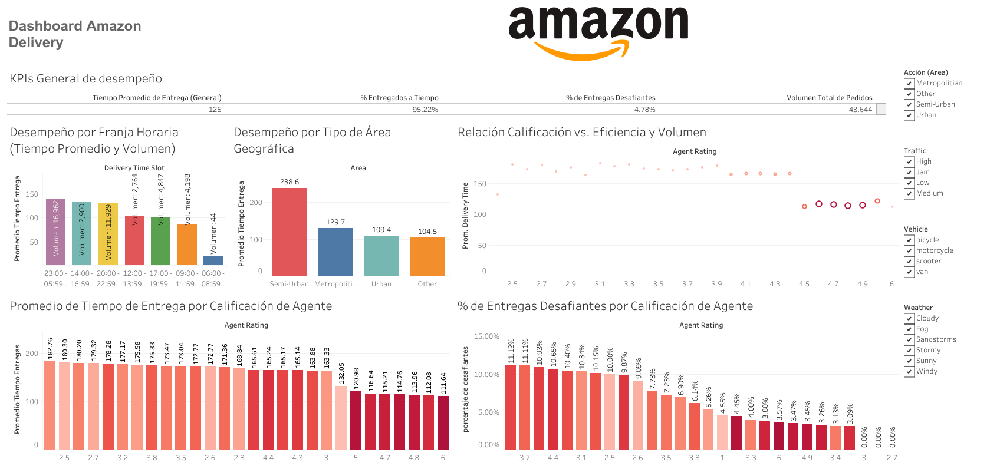

# 📊 Amazon Delivery 
# Análisis de eficiencia en entregas de última milla

Este proyecto consiste en un dashboard interactivo y la generación de reportes ejecutivos. Ambas herramientas están diseñadas para analizar el rendimiento de la entrega de pedidos. Los datos utilizados provienen de un conjunto de datos real de entregas recopilado por [Sujal Suthar](https://www.kaggle.com/datasets/sujalsuthar/amazon-delivery-dataset/data), con información valiosa para entender y mejorar la eficiencia operativa.

---

## 📚 Tabla de Contenidos

- [🎯 Propósito](#-propósito)
- [📦 Conjunto de Datos](#-conjunto-de-datos)
- [🧪 Desarrollo del Proyecto](#-desarrollo-del-proyecto)
- [📌 Vista previa del Dashboard](#-vista-previa-del-dashboard)
- [💡 Insight clave](#-insight-clave)
- [🛠️ Tecnologías](#️-tecnologías)
- [📂 Archivos](#️-instalación)
- [👤 Autor](#-autor)
- [📝 Licencia](#-licencia)

---

## 🎯 Propósito

El propósito principal de este proyecto es optimizar la eficiencia en la entrega de pedidos. Para lograrlo, analizaremos datos en tiempo real con el fin de:

- Evaluar la eficiencia general de nuestras entregas.
- Identificar zonas geográficas y franjas horarias con mayores desafíos operativos.
- Reconocer el desempeño individual de los repartidores, destacando a los más eficientes y detectando áreas de mejora.
---

## 📦 Conjunto de Datos

El conjunto de datos utilizado contiene las siguientes columnas:

- `Order_ID`: Identificador único para cada pedido
- `Agent_age`: Edad del agente de entrega
- `Agent_Rating`: Calificación o puntuación de desempeño del agente de entrega
- `Store_Latitude`: Coordenadas geográficas (latitud) de la tienda donde se realizó el pedido
- `Store_Longitude`: Coordenadas geográficas (longitud) de la tienda donde se realizó el pedido
- `Drop_Latitude`: Coordenadas geográficas (latitud) del lugar de entrega
- `Drop_Longitude`: Coordenadas geográficas (longitud) del lugar de entrega
- `Order_Date`: Fecha en que se realizó el pedido
- `Order_Time`: Hora del pedido
- `Pickup_Time`: Hora en que se recogió el pedido para su entrega
- `Weather`: Condiciones climáticas durante la entrega (por ejemplo: sunny, rainy, snowy)
- `Traffic`: Condiciones del tráfico durante la entrega (por ejemplo: low, medium, jam)
- `Vehicle`: Tipo de vehiculo utilizado para la entrega (por ejemplo: van, motorcycle, bicycle, scooter)
- `Area`: Zona donde se realizó la entrega (Urban, Metropolitan)
- `Delivery_Time`: Tiempo que llevo completar la entrega
- `Category`: Categoría de producto del articulo pedido (por ejemplo: electronics, apparel, groceries)

Fuente: [Amazon Delivery Dataset](https://www.kaggle.com/datasets/sujalsuthar/amazon-delivery-dataset).

---

## 🧪 Desarrollo del Proyecto

1. **Carga y exploración inicial de los datos**:
   - Exploración básica con `.head()`, `.info()`, `.describe()`, etc.

2. **Limpieza y preprocesamiento**:
   - Manejo de valores nulos, duplicados, formatos y conversiones de fechas.

3. **Análisis exploratorio de datos (EDA)**:
   - [Ej. Distribución, correlaciones, agrupaciones, etc.]

4. **Visualización de datos**:
   - Uso de gráficos de barras, líneas, cajas, dispersión y mapas de calor.

5. **Modelado o reportes (opcional)**:
   - [Si aplica: modelos de ML, clustering, predicciones, etc.]

6. **Conclusiones y recomendaciones**:
   - Síntesis de hallazgos clave y propuestas de acción.

---

## 📌 Vista previa del Dashboard

Link: [Dashboard Amazon Delivery](https://public.tableau.com/app/profile/said.mariano/viz/Dashboard_Amazon_Delivery/Dashboard_Amazon_Delivery)}

---

## 💡 Insight clave

- [Insight 1]
- [Insight 2]
- [Recomendación práctica o estratégica basada en los datos]

---

## 🛠️ Tecnologías

- **Python** - Limpeieza de datos y análisis de datos
   - Pandas
   - Numpy
   - Matplotlib
   - Seaborn
   - Jupyter Notebook
- **Kaggle** - Fuente de datos 
- **Tableau** - Visualización de datos y creación de Dashboard
- **GitHub** - Repositorio

---

## 📂 Archivos
- [amazon_delivery.csv](data/raw/amazon_delivery.csv): Conjunto de datos originales obtenido de Kaggle(sin procesar).
- [amazon_delivery.csv](data/processed/amazon_delivery_limpios.csv): Conjunto de datos limpios.
- [datos_entrega_procesados.csv](data/processed/datos_entrega_procesados.csv): Conjunto de datos granular y primario del análisis (Contiene cada registro de entrega individual, enriquecido con columnas calculadas y derivadas).
- [desafios_por_area_y_hora.csv](data/processed/desafios_por_area_y_hora.csv): Resume las métricas clave de desempeño (tiempo promedio de entrega, número total de entregas, número de entregas desafiantes y su porcentaje) por cada combinación única de Area (zona geográfica general) y Delivery_Time_Slot (franja horaria).
- [desafios_por_zona_geografica.csv](data/processed/desafios_por_zona_geografica.csv): Contiene métricas resumidas (tiempo promedio de entrega, número total de entregas, número de entregas desafiantes y su porcentaje) por Lat_Bin y Lon_Bin (coordenadas geográficas binned/agrupadas en celdas de cuadrícula).

---

## 👤 Autor

**Said Mariano Sánchez** – [📧](smariano170@gmail.com)
Analista de Datos Jr. | Visualización | Power BI | Python | SQL
🌎 México
Este proyecto forma parte de mi portafolio como analista de datos Jr.

---

## 📝 Licencia

Este proyecto está licenciado bajo la **Licencia MIT**. Puedes usarlo, modificarlo y distribuirlo libremente, siempre que menciones al autor original.

---